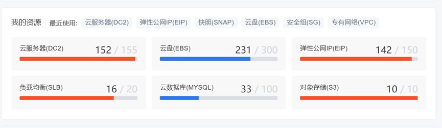

本文介绍云服务器DC2在产品功能和服务性能上的不同限制，以及如何申请更高配额。
##限制概述
使用云服务器DC2有下列限制：

- 建议不要自行升级弹性云服务器的内核版本和操作系统版本，如需升级操作系统的主版本，例如从CentOS 7.2升级到Cent OS 7.3，请使用提供的切换操作系统功能。
- 建议不要卸载弹性云服务器上预装的性能辅助优化软件。
- 	建议不要修改弹性云服务器网卡的MAC地址。

##查看配额
您可以在DC2控制台概览页面查看权益配额，支持查看某一地域中的部分资源使用情况和配额。如果某项资源的配额无法满足业务需求，请提交工单申请提升配额。

##限制项及限额
限制项|	普通用户限制|	提升限额方式
------------- | -------------|------------- 
创建DC2实例的用户限制|	实名认证|	无
一个账号最多创建的云服务器数量|	20个|	提交工单
一个账号最多创建的云盘数量	|100个|	提交工单
一个账号最多创建的快照数量	|200个|	提交工单
一个账号最多创建的弹性公网IP数量|	20个	|提交工单
一个账号最多创建的VPC数量|	5个|提交工单
一个账号最多创建的安全组数量|	20个|	提交工单
一个账号最多创建的负载均衡数量	|20个	|提交工单

