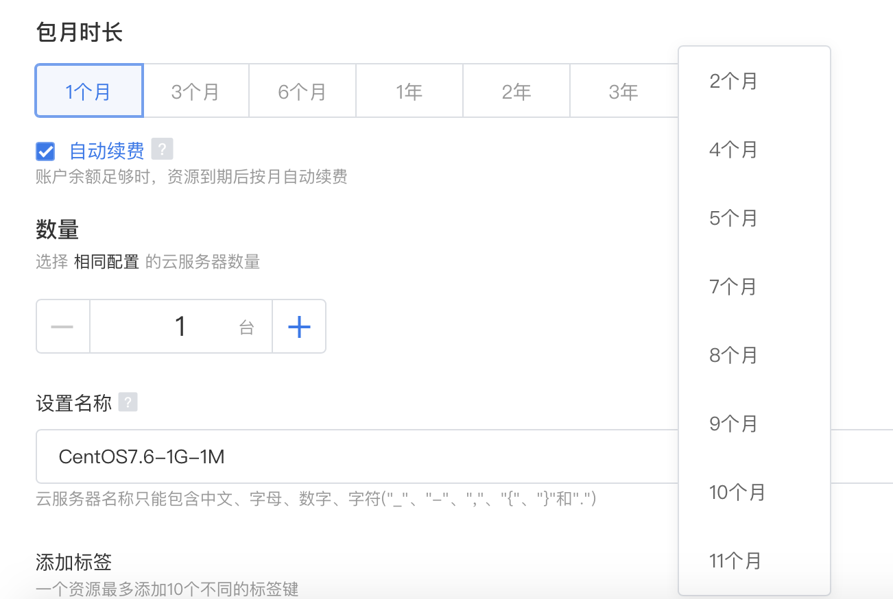

包年包月是一种先付费后使用的计费方式。通过包年包月，您可以提前预留资源，同时享受更大的价格优惠，帮您更大程度节省支出。本文主要介绍包年包月DC2资源的计费规则。

##包年包月简介
使用包年包月资源前，您需要创建一台包年包月DC2实例。包年包月DC2实例支持的购买时长如下：

* 在创建包年包月DC2实例时，CPU、内存、云盘、带宽等各项资源单独计费，汇总出总费用，您需要支付费用才能开始使用包年包月资源。请参见[费用计算](#jump)。 
* 创建包年包月DC2实例后，您可以修改实例配置。目前仅支持升级配置，不支持降低配置。请参见[升级配置](#jump2)。 
* 创建包年包月DC2实例后，您可以扩容云盘，扩容云盘后的费用请参见[云盘计费方式](./云盘计费方式.md)。
* 到期后资源状态变化请查看[到期后资源状态变化](#jump3)。如果您需要在当前资源到期后继续使用包年包月资源，可以续费包年包月实例。请参见[续费](./续费.md)。
* 如果您持有多台包年包月DC2实例或不同云资源，可以在续费时使用统一到期日功能将各资源的到期日对齐到各月份的同一天，方便统一管理续费时间，请参见[续费](./续费.md)。

##费用计算

包年包月DC2资源的计费周期为您购买的时长，一个计费周期的起点为开通或续费资源的时间 （精确到秒），终点为到期日的相同时间。

例如，您在2020年3月1日13:00:00创建一台包年包月DC2实例，相关DC2资源包括实例、镜像和云盘（系统盘）。购买时长为1个月，并在到期前手动续费1个月，则： 

* 第一个计费周期为2020年3月1日13:00:00～2020年4月1日13:00:00。
* 第二个计费周期为2020年4月1日13:00:00～2020年5月1日13:00:00。 

您需要为每个计费周期预先付费， 各项DC2资源单独计费，汇总出需要为一个计费周期支付的总费用。各项DC2资源的计费公式如下表所示： 

|资源类型        | 计费公式  | 资源单价  |
| --------    | -----: | -----: |
| DC2实例（含系统盘）     | 实例规格单价 * 计费周期 |   实例规格单价请参见[实例计费方式](./实例计费方式.md)  |  
| 镜像        |   免费  |  免费  |  
| 云盘(数据盘)        |    云盘单价 * 云盘容量 * 计费周期  |  云盘(数据盘)单价请参见[云盘计费方式](./云盘计费方式.md)    |  
| 公网带宽（按固定带宽）        |    固定带宽单价 * 固定带宽大小 * 计费周期  |   公网带宽单价请参见[公网带宽计费方式](./公网带宽计费方式.md)   |  

##到期后资源状态变化
到期后状态变化如下： 
1. 到期后，DC2实例进入已过期状态，此时您可以续费实例，续费成功后保留所有资源。 
2. 到期后3天内，DC2实例随时会从已过期状态进入过期回收中状态，释放部分资源，此时您可以续费实例。 
3. 到期7天后，释放或解绑所有DC2资源且不可恢复。 
>说明：  
>资源到期后即进入停服状态，到期3天内不续费资源会被删除，到期7天后资源将彻底被删除且不可恢复。

##升级配置
DC2创建完成后，如您因业务需要调整配置，可以在资源未到期前修改配置，目前只支持由低到高升级配置，您只需补齐相应的差价即可完成升配操作。
操作步骤如下：

1. 登录DC2管理控制台。
2. 在左侧导航栏，单击**云服务器列表**。 
3. 在顶部状态栏左上角处，选择地域。 
4. 在云服务器列表中找到待操作的DC2实例，在**操作**列单击**详情**。 
5. 在付费信息区域单击**修改配置**。 
 
6. 选中配置后，单击**关机并修改**即可。 

>说明：
>>1. 资源未到期之前升级配置，到期日保持不变。
>>2. 滴滴云DC2暂不支持包年包月转时长操作，您可以在包年包月到期后对DC2实例进行计费模式切换操作。

##退款
包年包月DC2资源支持退款。具体操作请参见[退订说明](./退订说明.md)。