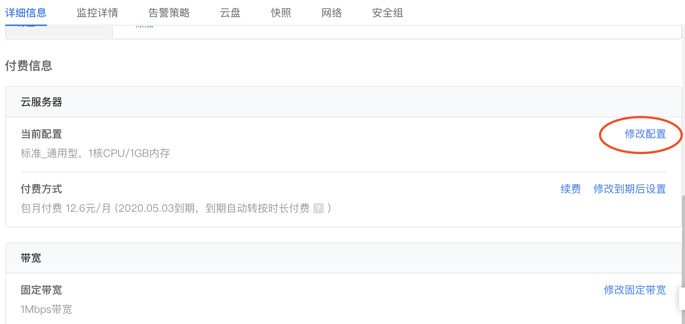

按时长是一种先使用后付费的计费方式。您可以按需购买和释放资源，无需提前购买大量资源。本文主要介绍按时长DC2资源的计费和结算规则。
##按时长简介
按时长DC2资源按照计费周期计费，在每个结算周期生成账单并从账户中扣除相应费用。
* 在创建按时长DC2实例时，CPU、内存、云盘、带宽等各项资源单独计费，汇总出总费用。请参见[费用计算](#jump)。 
* 创建按时长DC2实例后，您可以修改实例配置。目前仅支持升级配置，不支持降低配置。请参见[升级配置](#jump2)。 
* 创建按时长DC2实例后，您可以扩容云盘，扩容云盘后的费用请参见[云盘计费方式](./云盘计费方式.md)。 
* 创建按时长DC2实例后，您可以变更资源计费方式[按时长转包年包月](#jump3)。 
* 按时长DC2资源均为小时整点结算。请参见[结算周期](#jump4)。 
* 欠费后资源状态变化请查看[欠费后资源状态变化](#jump5)。

##费用计算

>说明：  
>按时长DC2实例一旦创建，无论对实例进行任何操作，全程都会计费，即使关机也正常计费。

|资源类型        | 计费周期  |  计费公式  | 资源单价  |
| --------    | -----: | -----: |-----: |
| DC2实例（含系统盘）     | 秒  | 实例规格单价 * 计费时长 |   实例规格单价请参见[实例计费方式](./实例计费方式.md)  |  
| 镜像        |  秒  |  免费  |  免费  |  
| 云盘(数据盘)        |    秒  | 云盘单价 * 云盘容量 * 计费时长  |  云盘(数据盘)单价请参见[云盘计费方式](./云盘计费方式.md)    |  
| 公网带宽（按固定带宽）        |   秒  |  固定带宽单价 * 固定带宽大小 * 计费时长  |   公网带宽单价请参见[公网带宽计费方式](./公网带宽计费方式.md)   |  

##结算周期
按时长DC2资源每一个小时整点结算一次费用，结算完毕后进入新的结算周期，如果您账户的可用额度（含滴滴云账户余额、代金券等）小于待结算的账单，会收到余额不足的短信或邮件提醒。

例如： 

* 您在01:30:30创建了一台按时长DC2实例，相关资源包括DC2实例、镜像和云盘（系统盘），然后在01:55:30释放DC2实例，则： 
  * 结算周期为01:00:00～02:00:00，在01:30:30～01:55:30间产生计费，该结算周期内的计费时长为1500秒。
* 您在10:59:30创建了一台按时长DC2实例，相关资源包括DC2实例、镜像和云盘（系统盘），然后在11:50:30释放DC2实例，则： 
  * 第一个结算周期为10:00:00～11:00:00，在10:59:30～11:00:00间产生计费，该结算周期内的计费时长为30秒。 
  * 第二个结算周期为11:00:00～12:00:00，在11:00:00～11:50:30间产生计费，该结算周期内的计费时长为3030秒。 

##升级配置
DC2创建完成后，如您因业务需要调整配置，可以随时修改配置，目前只支持由低到高升级配置，您只需补齐相应的差价即可完成升配操作。 
操作步骤如下：

1. 登录DC2管理控制台。
2. 在左侧导航栏，单击**云服务器列表**。 
3. 在顶部状态栏左上角处，选择地域。 
4. 在云服务器列表中找到待操作的DC2实例，在**操作**列单击**详情**。 
5. 在付费信息区域单击**修改配置**。 
 
6. 选中配置后，单击**关机并修改**即可。 

##按时长转包年包月
创建一台按时长计费的DC2后，您可以将DC2实例的计费方式转为包年包月。 
操作步骤如下： 
1. 登录DC2管理控制台。 
2. 在左侧导航栏，单击**云服务器列表**。 
3. 在顶部状态栏左上角处，选择地域。 
4. 找到待转换的DC2实例，在**计费方式**列，单击**转包月**。 
5. 选择续费包月的时长，单击**确认续费**。 

##欠费后资源状态变化
账户欠费后资源状态变化如下： 
1. 欠费后，DC2实例进入停服状态，此时您可以立即充值。 
2. 欠费3天内，DC2实例随时会被标记删除进入回收状态，此时您可以立即充值。 
3. 欠费10天后，释放或解绑所有DC2资源且不可恢复。 
>注意：
>>1. 账户欠费后资源即进入停服状态，欠费3天内不充值资源会被删除，欠费10天后资源将彻底被删除且不可恢复。
>>2. 购买按时长资源，请务必保证账户余额充足。