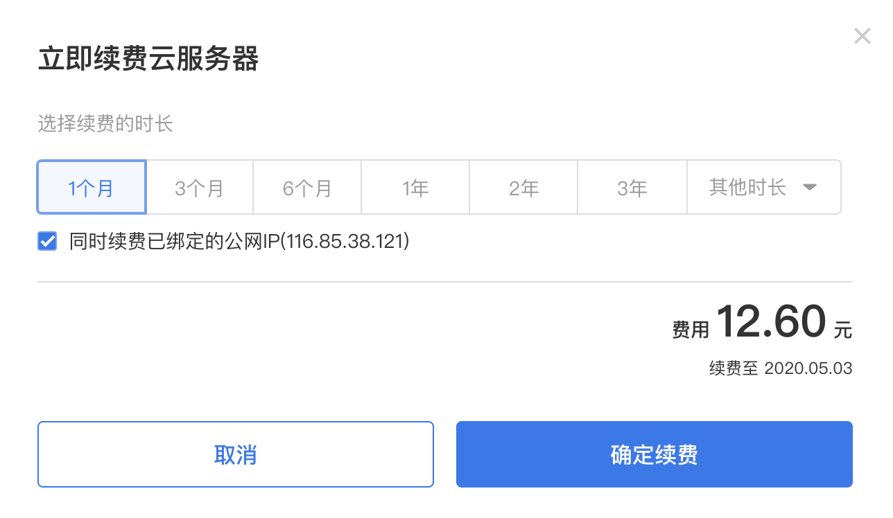
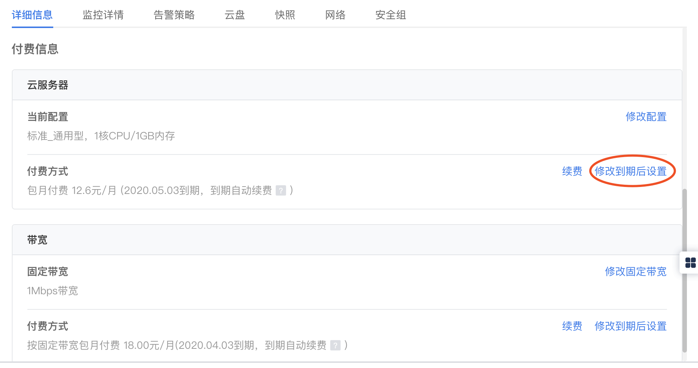
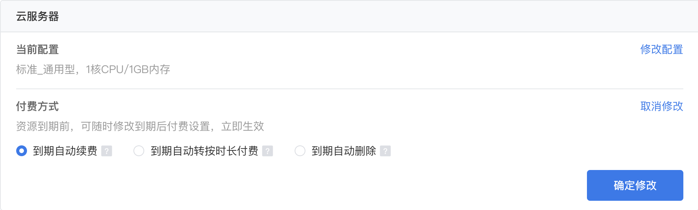
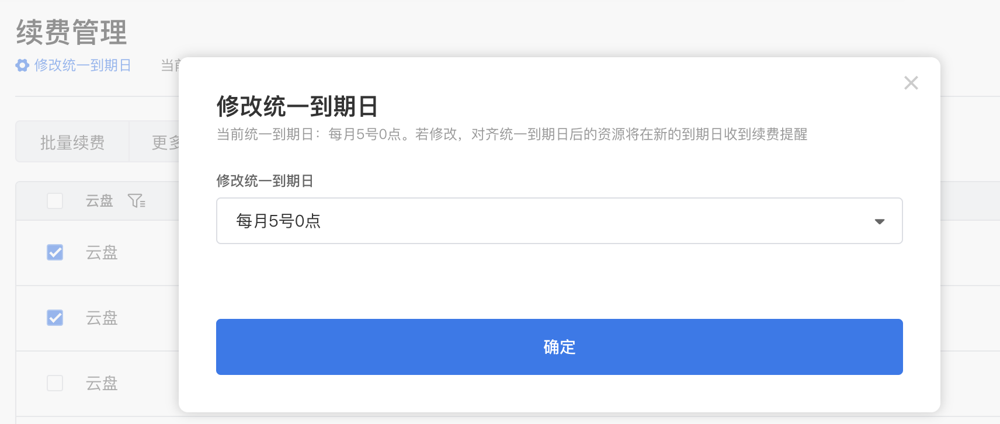

包年包月DC2实例到期后，如果您想继续使用DC2实例，需要在指定时间内为DC2实例续费，否则vCPU、内存、云盘等资源会自动释放，数据将永久丢失。本文介绍了DC2实例续费相关功能。
##续费简介
续费功能仅适用于包年包月DC2实例，按量付费DC2实例不需要续费，您只需要保证账户可用额度充足即可。 
DC2实例到期前续费成功，所有资源保留，ECS实例的运行不受影响。包年包月ECS实例到期后的状态说明，请参见[包年包月](./包年包月.md)。

##手动续费
在DC2实例到期被自动释放前，您随时可以在DC2管理控制台手动进行续费。 
操作步骤如下： 
1. 登录DC2管理控制台。 
2. 在左侧导航栏，单击**云服务器列表**。 
3. 在顶部状态栏左上角处，选择地域。 
4. 在云服务器列表中找到待续费的DC2实例，在**计费方式**列中，单击**续费**。 
5. 选择续费时长，单击**确定续费**。 
 

##自动续费
设置自动续费后，DC2实例会在每次到期前自动续费。 
>说明： 
>>包年包月DC2实例创建时默认为自动续费设置，您也可以在创建完成后修改。

操作步骤如下： 
1. 登录DC2管理控制台。 
2. 在左侧导航栏，单击**云服务器列表**。 
3. 在顶部状态栏左上角处，选择地域。 
4. 在云服务器列表中找到待操作的DC2实例，在**操作**列单击**详情**。 
5. 在付费信息区域单击**修改到期后设置**。 
 
6. 选中**到期自动续费**，单击**确定修改**即可。 
 
>说明：  
>云服务器和带宽可以分别修改付费方式。 

##修改到期设置
包年包月DC2实例支持三种到期处理方式，您可以按照[自动续费操作步骤](#jump)修改到期设置。 
>注意：
>>1. 滴滴云暂不支持到期修改云服务器配置操作。
>>2. 滴滴云将在资源到期前7天、3天、1天的工作时间(8:00~22:00)以短信、邮件及站内信的方式向您推送到期预警，如果您的资源所属为团队，团队成员均会收到预警。

* 到期自动续费 
* 到期自动转按时长续费 
* 到期自动删除 

##修改统一到期日
如果您持有多台包年包月DC2实例或不同云资源，可以在续费时使用统一到期日功能将各资源的到期日对齐到各月份的同一天，方便统一管理续费时间。 
操作步骤如下： 
1. 登录控制台，进入**费用中心 > 续费管理**。 
2. 选中待修改资源。 
3. 在顶部状态栏左上角处，单击**修改统一到期日**。 
 
4. 单击**确定**。 
>说明： 
>>修改成功后，对齐统一到期日后的资源将在新的到期日收到续费提醒。