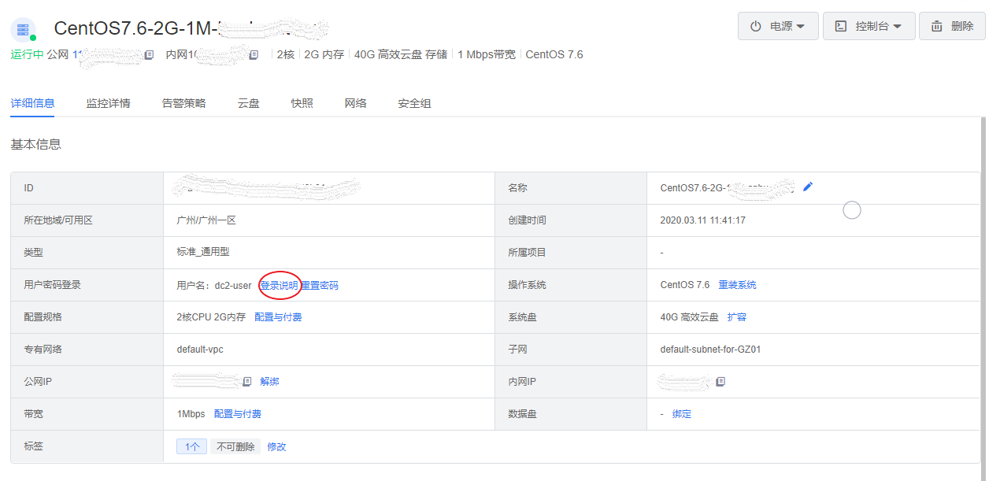
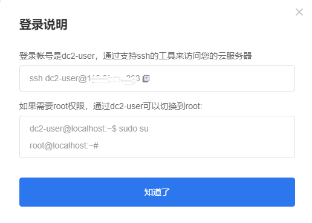
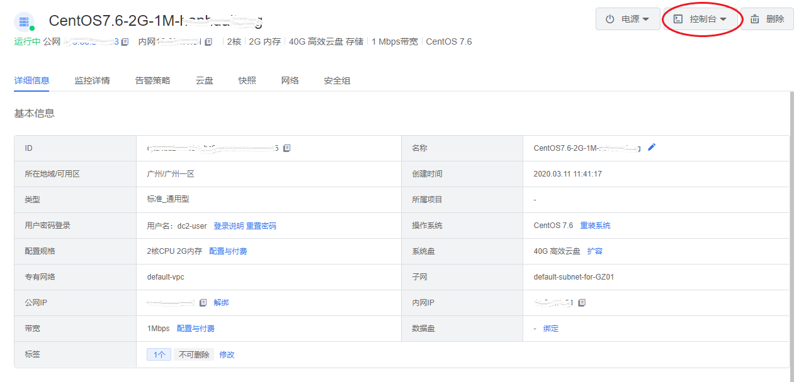
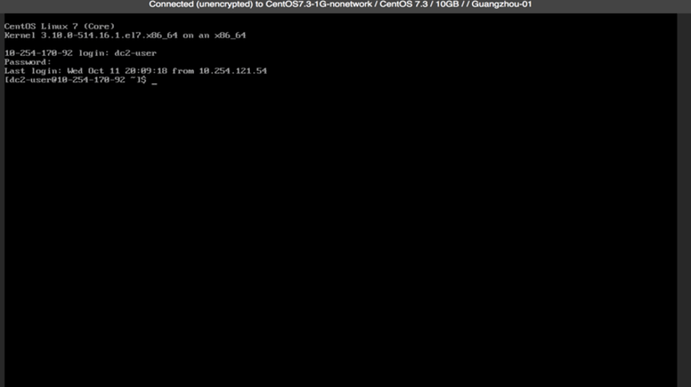

##准备工作
- 创建账号，以及完善账号信息。
注册滴滴云账号，并完成实名认证。具体操作，请参见[滴滴云账号注册](#anchorTarget)。
- 可选： 滴滴云提供一个默认的专有网络VPC，如果您不想使用默认的，可以在目标地域创建一个专有网络和交换。
- 可选： 滴滴云提供一个默认的安全组，如果您不想使用默认的，可以在目标地域创建一个安全组。

##滴滴云账号注册
如果用户已注册滴滴云账号，可直接登录管理控制台，访问云服务器DC2。如果用户没有登录管理控制台的帐号，请先注册滴滴云。本节介绍了注册滴滴云的操作方法。注册成功后，该帐号可访问公有云的所有服务，包括云服务器。
操作步骤
- 登录[滴滴云官网](http://www.didiyun.com/)。
- 单击“免费注册”。进入注册页面，根据提示信息完成注册； 注册成功后，系统会自动跳转至滴滴云官方网页。

##创建DC2实例
###创建云服务器须知

购买之前需注意：在购买滴滴云服务器前，请确保已经了解滴滴云服务器及其相关配置与价格，并根据实际需求购买。
1. 滴滴云提供两种进入创建云服务器(DC2)页面的入口：
     - 进入官网云服务器(DC2)页面，单击**立即体验**按钮。
     - 进入控制台云服务器(DC2)页面，单击**创建云服务器(DC2)**按钮。 

创建DC2分为四个步骤：
 
###步骤一：基础配置
 
1. 选择 计费模式:包括包月和按时长两种。
2. 选择 可用区:选择靠近您客户的地域，包括广州1、2区和北京一区。
3. 设置 服务器类型:根据需求选择标准云服务器或者GPU服务器，并选择具体型号。
4. 选择 镜像:包括标准镜像、一键部署镜像和自定义镜像，这里选择标准镜像>CentOS。
5. 选择 配置:根据需要的CPU、GPU、显卡和内存，选择相关配置。
6. 设置 系统盘和数据盘:根据需求选择系统盘和数据盘的大小。

###步骤二：网络配置
1. 选择 所属VPC和内网:选择已有专有网络，如果没有，可以到VPC控制台创建。同时选择内网IP分配方式，包括自动分配和手动设置两种。
2. 选择 弹性公网IP:按照业务类型，选择按照流量或者带宽付费。
3. 选择 安全组:可以选择已有安全组或者新建安全组，请确保选中安全组开放包含22（Linux）或者3389（Windows）端口，否则无法远程访问云服务器；通过新建安全组创建默认放开22或3389的安全组。

###步骤三：系统配置
1. 选择 登录方式:可以选择三种登录方式之一：密码登录、SSH Key或者创建后设置。
2. 设置云服务器名称。可支持批量有序设置。
3. 设置 标签:最多可添加10个不同的标签。

###步骤四：确认订单
1. 购买时长：您可以选择包月时长。
2. 自动续费：默认勾选，账户余额足够时，资源到期后按月自动续费。
 - 设置成功后，自动续费周期为1个月；
 - 自动续费将于资源到期前7天进行扣费，请保持余额充足；
 - 支持云券及余额支付。

3. 选择数量 ：用户默认最大可批量创建10台云服务器，如需增加配额，可联系客服

4. 服务协议：需要勾选“我已阅读并同意《退订规则》”

 
    
##访问DC2实例
###访问Linux云服务器须知
滴滴云为您提供了控制台方便您远程连接并管理DC2实例。同时您也可以通过SSH命令远程连接至DC2实例。出于安全性的考虑，DC2实例默认用户为dc2-user，您在远程连接DC2实例时需要以dc2-user的账户来进行登录。

注：公钥创建的DC2实例无法直接通过控制台访问。
###ssh方式访问云服务器（DC2）
已购买带宽的云服务器可以通过外网IP访问。

没有购买带宽的云服务器可以利用已购买带宽的服务器通过内网IP访问, 访问方式相同。

1. 进入云服务器(DC2)页面，在**操作列**单击**详情**。
2. 进入云服务器(DC2)详情页面,单击**登陆说明**。

 

3. 按照如下方式访问云服务器DC2。

 
###控制台方式访问云服务器(DC2)

1. 进入云服务器(DC2)页面，在**操作列**单击**详情**。

2. 进入云服务器(DC2)详情页面，单击**控制台**。

 

3. 进入控制台页面，页面光标在login:后闪动，此时需要您输入DC2实例的账户名（您可以输入DC2的默认账户dc2-user或自定义的账户名）后敲击回车。
4. 输入您在创建实例时所设置的密码,即可登录您的DC2实例。

  
##（可选）删除DC2实例
如果您不再需要这台实例，可以将其删除。释放后，实例停止计费，数据不可恢复。该操作仅适用于按时长付费实例，不支持手动删除包年包月实例.

1. 在**我的云服务器**页面，选择想要删除的云服务器。
2. 在该服务器的操作列中，在**操作列**单击**删除云服务器**。　
3. 在弹窗确认要删除的云服务器，单击确认删除。

