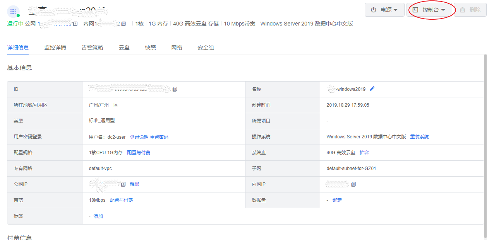
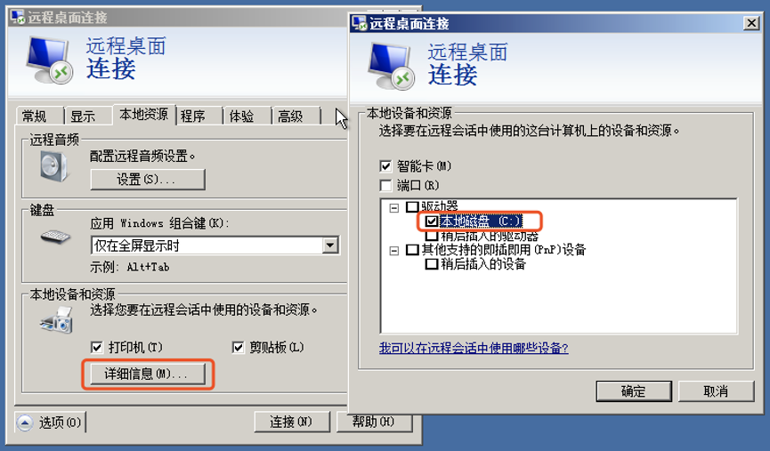

##准备工作
- 创建账号，以及完善账号信息。
注册滴滴云账号，并完成实名认证。具体操作，请参见[滴滴云账号注册](#anchorTarget)。
- 可选： 滴滴云提供一个默认的专有网络VPC，如果您不想使用默认的，可以在目标地域创建一个专有网络和交换。
- 可选： 滴滴云提供一个默认的安全组，如果您不想使用默认的，可以在目标地域创建一个安全组。

##滴滴云账号注册
如果用户已注册滴滴云账号，可直接登录管理控制台，访问云服务器DC2。如果用户没有登录管理控制台的帐号，请先注册滴滴云。本节介绍了注册滴滴云的操作方法。注册成功后，该帐号可访问公有云的所有服务，包括云服务器。
操作步骤
- 登录[滴滴云官网](http://www.didiyun.com/)。
- 单击“免费注册”。进入注册页面，根据提示信息完成注册； 注册成功后，系统会自动跳转至滴滴云官方网页。

##创建DC2实例
###创建云服务器须知

购买之前需注意：在购买滴滴云服务器前，请确保已经了解滴滴云服务器及其相关配置与价格，并根据实际需求购买。

创建DC2分为四个步骤：
 
###步骤一：基础配置
 
1. 选择 计费模式:包括包月和按时长两种。
2. 选择 可用区:选择靠近您客户的地域，包括广州1、2区和北京一区。
3. 设置 服务器类型:根据需求选择标准云服务器或者GPU服务器，并选择具体型号。
4. 选择 镜像:包括标准镜像、一键部署镜像和自定义镜像，这里选择标准镜像>CentOS。
5. 选择 配置:根据需要的CPU、GPU、显卡和内存，选择相关配置。
6. 设置 系统盘和数据盘:根据需求选择系统盘和数据盘的大小。

###步骤二：网络配置
1. 选择 所属VPC和内网:选择已有专有网络，如果没有，可以到VPC控制台创建。同时选择内网IP分配方式，包括自动分配和手动设置两种。
2. 选择 弹性公网IP:按照业务类型，选择按照流量或者带宽付费。
3. 选择 安全组:可以选择已有安全组或者新建安全组，请确保选中安全组开放包含22（Linux）或者3389（Windows）端口，否则无法远程访问云服务器；通过新建安全组创建默认放开22或3389的安全组。

###步骤三：系统配置
1. 选择 登录方式:可以选择三种登录方式之一：密码登录、SSH Key或者创建后设置。
2. 设置云服务器名称。可支持批量有序设置。
3. 设置 标签:最多可添加10个不同的标签。

###步骤四：确认订单
1. 购买时长：您可以选择包月时长。
2. 自动续费：默认勾选，账户余额足够时，资源到期后按月自动续费。
 - 设置成功后，自动续费周期为1个月；
 - 自动续费将于资源到期前7天进行扣费，请保持余额充足；
 - 支持云券及余额支付。

3. 选择数量 ：用户默认最大可批量创建10台云服务器，如需增加配额，可联系客服

4. 服务协议：需要勾选“我已阅读并同意《退订规则》”

 

##访问DC2实例
###访问Windows 版云服务器须知
滴滴云为您提供了VNC控制台方便您远程连接并管理 Windows 版的DC2实例。同时，您也可以通过远程桌面连接至DC2实例。出于安全性的考虑，DC2实例默认用户名为 dc2-user，您在远程连接DC2实例时需要以 dc2-user 的账户来进行登录。

目前 Windows 版云服务器可以通过控制台或远程桌面连接进行访问。
###通过控制台访问

1. 进入云服务器(DC2)详情页面，单击**VNC控制台**，即可进入登录画面。

 
 
2. 根据提示使用键盘输入 CTRL+ALT+DELETE 或鼠标点击屏幕按键开始登录，输入密码后登录。

 

 

需要注意的是，如果创建云服务器时,"选择登录方式”选定了“创建后设置”，需要在控制台的云服务器详情页面**设置密码**后才能登录。 

###通过远程桌面连接访问
#### 使用 Windows 操作系统
使用 Windows 操作系统的设备连接云服务器，可以使用系统自带的远程桌面连接软件或从微软下载最新版软件。
1. 以系统自带软件为例，可以从程序中找到，或运行 mstsc 命令打开远程桌面连接。

  

2. 单击选项展开**远程桌面**的高级设置，输入用户名，勾选“允许我保存凭据”，点击连接。
 
 

 
 
3. 如果需要连接本地资源，可以在详细信息中勾选对应的设备或资源。
 
 

####使用 Mac 操作系统
使用 Mac 操作系统的设备连接云服务器，需要下载远程桌面连接软件，可以从微软（[https://docs.microsoft.com/zh-cn/windows-server/remote/remote-desktop-services/clients/remote-desktop-mac）](https://docs.microsoft.com/zh-cn/windows-server/remote/remote-desktop-services/clients/remote-desktop-mac)下载或使用兼容的第三方软件，以微软的 Remote Desktop Client for Mac 为例。
1. 单击"+"或“Add desktop”开始添加远程桌面，在“PC Name”中输入云服务器IP地址。

 

2. “User Account”选择"Add User Account”保存登录凭据。

 
 
3. 单击“Show More”可以为云服务器设置别名， 如在“Friendly Name”中输入“My First DC2”，也可以在“Local Resources”中选择要加载的本地资源（如Download文件夹等），单击"Save”保存当前的远程桌面连接。
 
  

  
 
4. 双击刚才保存的远程桌面开始连接云服务器。

  

5. 点击Continue并输入密码即可进入Windows桌面。
 
 

 

####使用 Linux 操作系统
使用 Linux 操作系统的设备连接云服务器，可以使用 rdesktop 或其他第三方提供的远程桌面软件，依照软件说明完成连接。

####使用移动设备
使用移动设备（iOS 或 Android）连接云服务器，从应用市场中搜索微软（Microsoft Remote Desktop）或第三方提供的远程桌面App，依照指引即可完成连接。

##（可选）删除DC2实例
如果您不再需要这台实例，可以将其删除。释放后，实例停止计费，数据不可恢复。该操作仅适用于按时长付费实例，不支持手动删除包年包月实例.

1. 在**我的云服务器**页面，选择想要删除的云服务器。
2. 在该服务器的操作列中，在**操作列**单击**删除云服务器**。　
3. 在弹窗确认要删除的云服务器，单击确认删除。

 