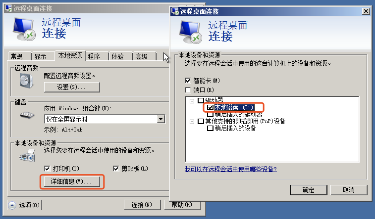

滴滴云为您提供了VNC控制台方便您远程连接并管理 Windows 版的DC2实例。同时，您也可以通过远程桌面连接至DC2实例。出于安全性的考虑，DC2实例默认用户名为 dc2-user，您在远程连接DC2实例时需要以 dc2-user 的账户来进行登录。
##操作步骤

###使用Windows系统连接

使用 Windows 操作系统的设备连接云服务器，可以使用系统自带的远程桌面连接软件或从微软下载最新版软件。以系统自带软件为例，可以从程序中找到，或运行 mstsc 命令打开远程桌面连接。

1. 单击选项展开远程桌面的高级设置，输入用户名，勾选“允许我保存凭据”，单击连接。

2. 如果需要连接本地资源，可以在详细信息中勾选对应的设备或资源。

###使用MAC操作系统连接

使用 Mac 操作系统的设备连接云服务器，需要下载远程桌面连接软件，可以从[微软](https://docs.microsoft.com/zh-cn/windows-server/remote/remote-desktop-services/clients/remote-desktop-mac)下载或使用兼容的第三方软件，以微软的 Remote Desktop Client for Mac 为例。

1. 单击"+"或“Add desktop”开始添加远程桌面，在“PC Name”中输入云服务器IP地址，“User Account”选择"Add User Account”保存登录凭据。

2. 单击“Show More”可以为云服务器设置别名， 如在“Friendly Name”中输入“My First DC2”，也可以在“Local Resources”中选择要加载的本地资源（如Download文件夹等），单击"Save”保存当前的远程桌面连接。

3. 双击刚才保存的远程桌面开始连接云服务器。

4. 登录进入windows服务器页面

 - 单击Continue并输入密码即可进入Windows桌面

