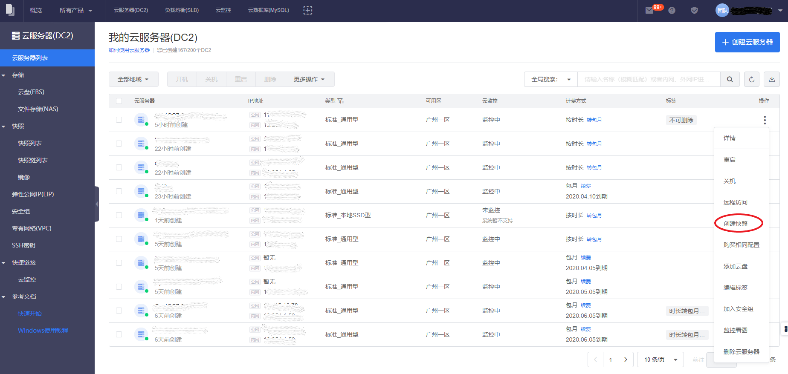
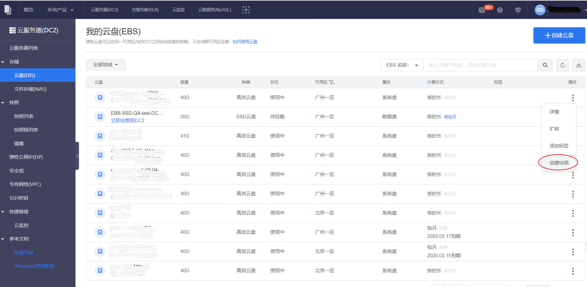

##创建DC2系统盘快照

您可以对DC2实例上的系统盘创建快照。需要指出的是，快照仅保存快照操作的那一刹那已经持久化到系统盘上的数据。在快照时刻处于操作系统缓存、未落盘的数据则很可能不会保存到快照。

>注意：
>Linux实例制作快照时，请确保/etc/fstab不包含数据盘配置，否则会导致使用该快照创建的自定义镜像生成的实例无法正常启动。如果有挂载数据盘，需要注释或删掉/etc/fstab中自行配置的数据盘的相关配置。

###操作步骤
1. 登陆到滴滴云控制台，单击**“云服务器列表”**，单击进入云服务器列表页。
2. 选择需要系统盘快照的云服务器，在右边的操作选项中单击**“创建快照”**，进入创建快照页面。
3. 在创建快照页面，您可以编辑快照名（默认的快照命名规则为“云服务器名称”加日期后缀）。
4. 单击确认创建后，将出现创建快照进度条，待快照创建成功后您就可以看到新创建的快照详情。
   

##创建EBS云盘快照
您可以对已经挂载到DC2实例上正在使用中的EBS云盘做快照。需要指出的是，快照仅保存快照操作的那一刹那已经持久化到EBS云盘上的数据。在快照时刻处于操作系统缓存、未落盘的数据则很可能不会保存到快照。因此，快照不一定能确保您的数据的完整性。如果需要确保数据完整性和强一致性，那么最好是停掉应用程序写入，并且将EBS卷从DC2实例上卸载掉再做快照，待快照后再挂载回来。

###操作步骤

1. 登陆到滴滴云控制台，单击**“存储”**，单击**“云盘（EBS）”**，进入云盘列表页。
2. 选择需要快照的目标云盘，在右边的**操作列**中选择**“创建快照”**，进入创建快照页面。
3. 在创建快照页面，您可以编辑快照名（默认的快照命名规则为“EBS云盘名”加日期后缀）。
4. 点击确认创建后，将出现创建快照进度条，待快照创建成功后您就可以看到新创建的快照详情。

