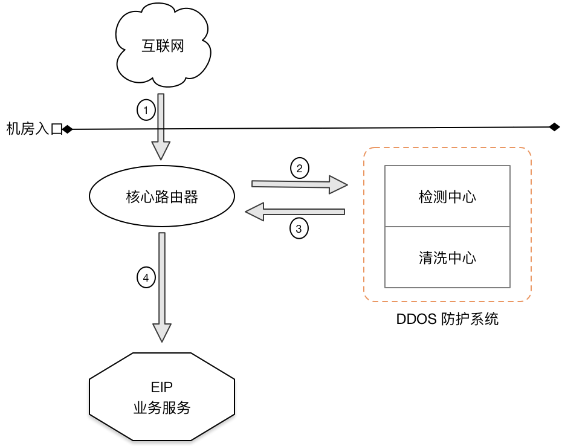
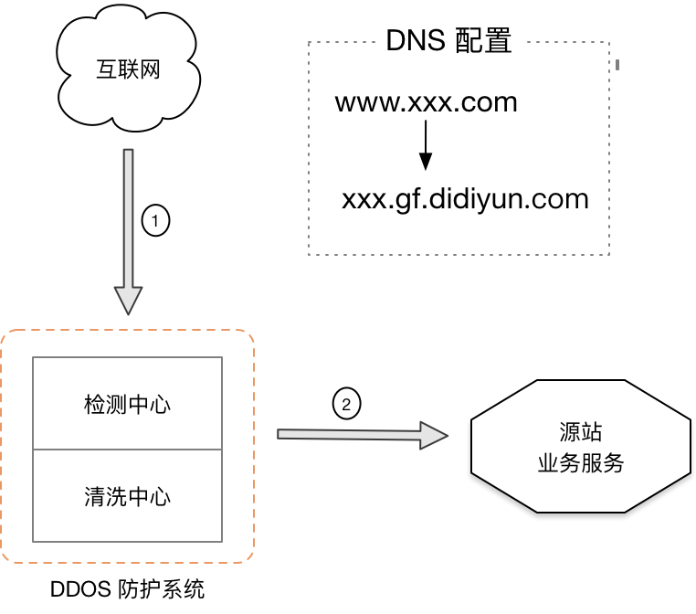

DDOS（分布式拒绝服务） 攻击是互联网上一种常见的攻击方式，它利用大量的网络数据包，恶意的去访问某一个互联网服务，导致访问量远远超出服务的承载能力，造成服务瘫痪。该攻击方式发起的成本较低，但对业务的危害很大，轻者造成服务不稳定，影响使用体验，重则造成服务完全不可用，业务下线。
只要开放到互联网上的服务，都有可能成为 DDOS 攻击的对象，而滴滴云推出的 DDOS 高防产品就是为了要解决这个问题。
滴滴云 DDOS 高防产品分为两个版本：基础防护版、高防实例版。

## 基础防护版
该版本无需用户购买，只要使用滴滴云带有 EIP 的产品，都会默认免费开通。
基础防护版会实时检测所有 EIP 的流量情况，如果发现有 DDOS 攻击发生，会将被攻击EIP 的入口流量牵引到清洗中心，只有被确认安全的流量才会由清洗中心重新回源到EIP 上。
其技术架构图如下：
攻击发生前：

攻防发生后：

基础防护版对 DDOS 的检测和清洗操作，业务都是无感知的，目前支持TCP（syn flood、ack flood、rst flood、fin flood），UDP，ICMP等主流的DDOS 攻击类型，但该版本的清洗能力有限，只能对小于1G 的攻击进行清洗。
如果需要更大能力的 DDOS防护，请使用高防实例版。
## 高防实例版
该版本主要为了防御大流量的 DDOS 攻击而推出的解决方案，单实例的最高清洗能力可达每秒100G。
高防实例版采用智能的 DDOS 检测算法，秒级识别攻击，对于主流的攻击类型，清洗成功率达到99.99%；在接入线路上，使用30线 BGP线路，平均访问延迟小于30ms。
用户购买该产品后，滴滴云会分配一个独立的 CName 域名供用户接入，只有经过高防确认干净的流量才会转发到源站上，其技术架构图如下：

没有攻击时，高防实例只是将流量转发到源站服务，并进行实时流量检测；当有攻击发生时，高防实例会根据智能识别算法，清洗掉攻击的流量，只转发正常的业务流量给源站服务。