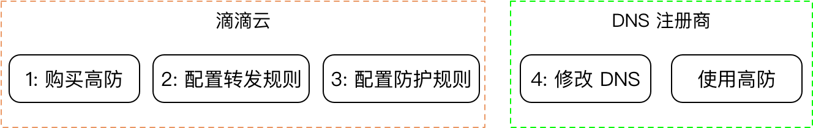
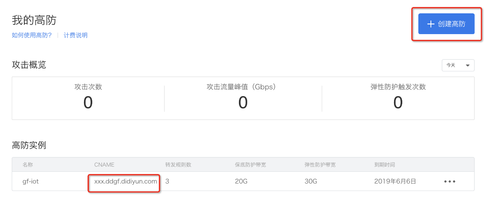
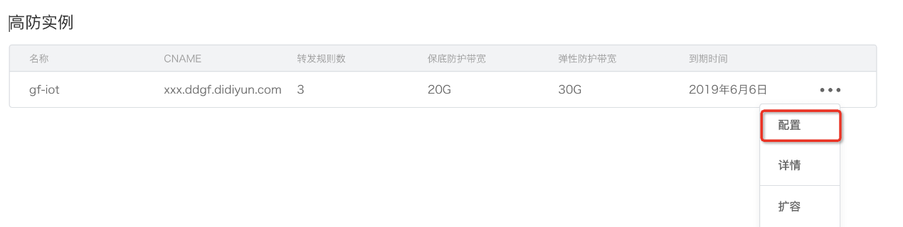
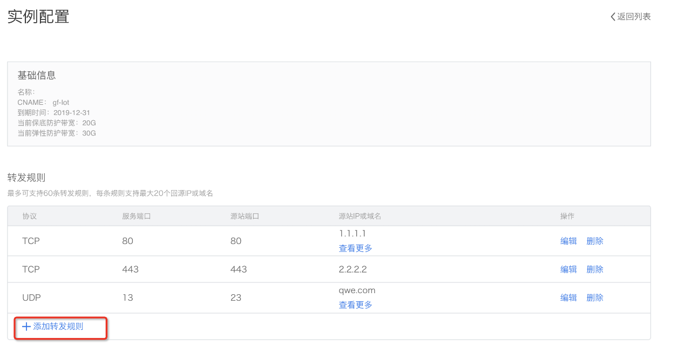
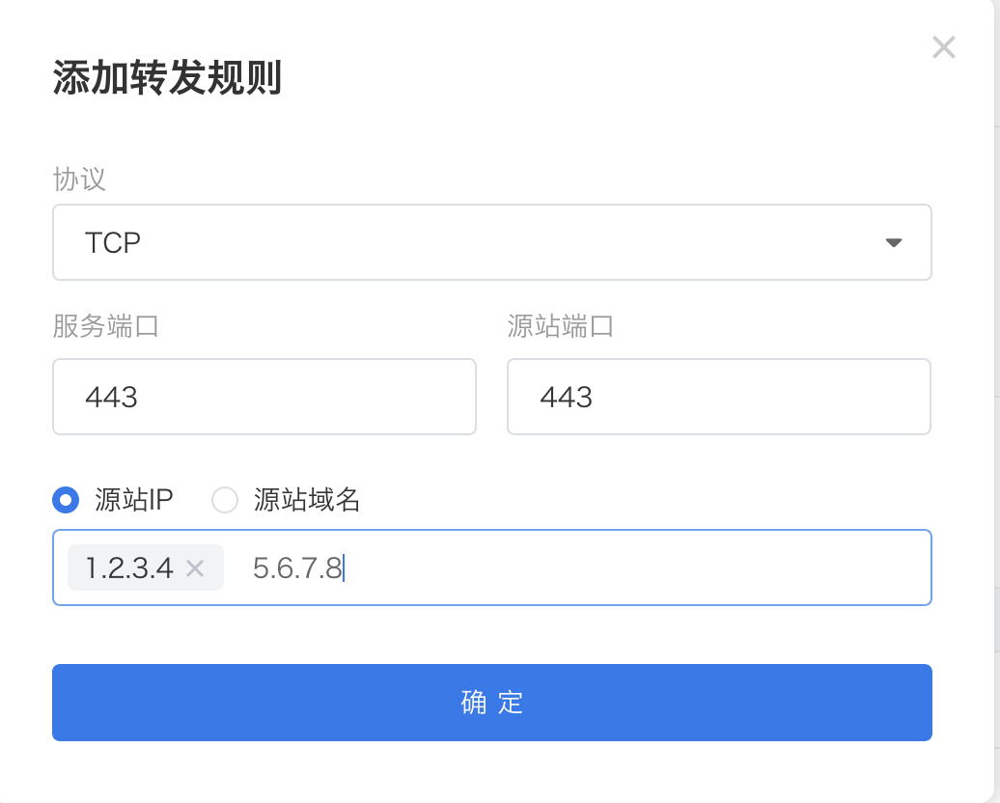
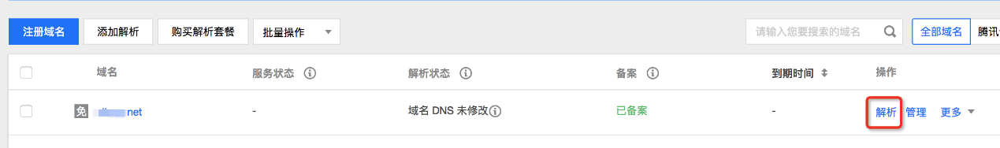
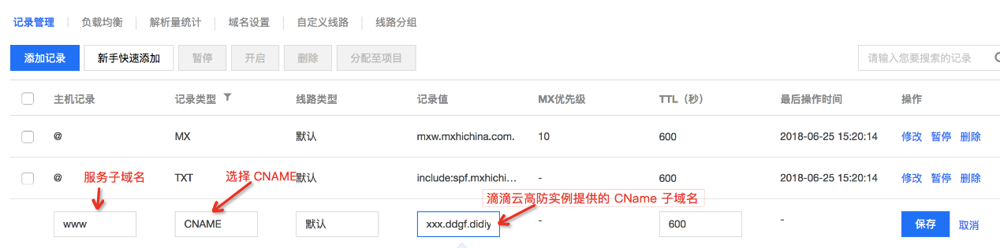

## 简要步骤

1. 登录高防产品控制台，点击**"+创建高防"**按钮，按照业务需求选择合适的高防规格及购买时长，付款后，滴滴云会生成一个高防实例（类似于xxx.ddgf.didiyun.com 的 CName 子域名）。
2. 配置高防转发规则，添加服务端口和源站信息。
3. 配置防护规则，目前仅支持 IP 黑白名单，如果没有黑白名单，可省略该步骤。
4. 在 DNS 注册商平台上，修改需要保护的域名的 CName 指向到高防实例提供的 CName 子域名。
5. 开始使用高防。
## 详细步骤
1. 登录**滴滴云控制台**，单击一级菜单**“安全”**，在下拉菜单中选择**“DDOS 高防”**，进入高防产品控制台。

单击右上角的**“+创建高防”**按钮，进入高防实例购买流程，具体购买流程请参考“[购买高防](./购买高防.md)“。
购买完成后，会生成一个高防的 CName 子域名，如上图左下角红框内字样。
对于已有的高防实例，可修改**“名称”**为容易记忆的名字。
2. 在高防实例列表中，找到需要进行转发规则配置的行，单击最右面的**"..."**，会弹出如下图所示菜单。

单击**“配置”**菜单项，进入高防配置页面。 

**基础信息**一栏显示的是高防实例的相关信息，**转发规则**是用户已经配置的转发规则，已经配置的转发规则支持编辑和删除操作。
3. 如果需要添加新的转发规则，请单击上图红框内的**“+添加转发规则”**，弹出如下窗口。

**协议**是指高防实例需要提供的服务协议，目前仅支持 TCP 和 UDP。
**服务端口**是高防实例提供的服务端口。
**源站端口**是指高防实例进行流量回源的端口。
流量回源支持两种方式：IP 回源和域名回源，其中IP 回源仅支持公网IP。
4. 经过前三步，滴滴云高防已经配置好了，可以直接使用高防实例提供的 CName 域名来提供服务，也可以在 DNS 注册商处，将已经正在使用的域名指向到高防实例的 CName 域名上，下面以腾讯云 DNS 域名管理为例，来说明配置流程。
4.1. 进入腾讯云域名服务页面       
选择需要配置的域名，单击操作栏里的“解析”，会进入解析配置页面 
