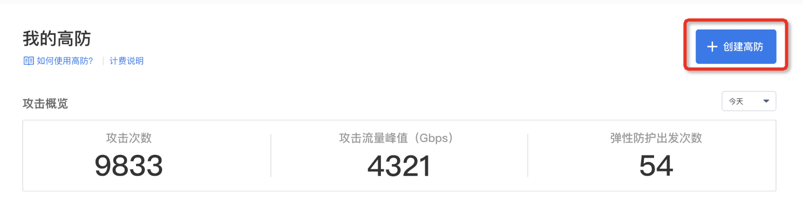
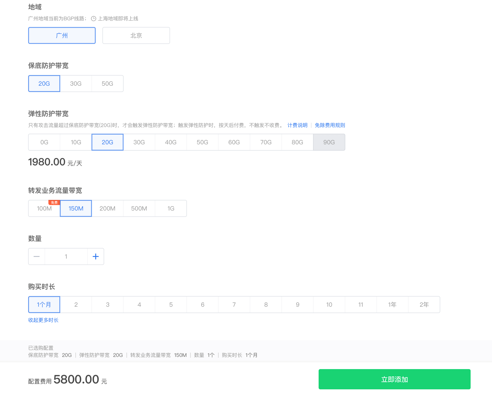

>说明：
>在使用高防产品时，必须先购买高防实例，不同规格的实例价格不一样，建议按照业务情况进行购买。

1. 登录**滴滴云控制台**，进入**“DDOS 高防”**产品主页，单击右上方的**“+创建高防”**按钮。

2. 进入高防购买页面，按照业务情况选择各参数规格。

>说明：
>
>1. 目前**地域**支持“广州”和“北京”，均为 BGP 线路，上海区域即将上线。
>2. **保底防护带宽**为必选项，属于高防实例的基础参数，按月预计费，保底防护带宽的服务期限也即是高防实例的服务期限。
>3. **弹性防护带宽**为可选项，当攻击流量超过保底防护带宽时，会触发弹性防护带宽。如果用户没有选择弹性防护带宽，当攻击流量超过保底防护带宽时，会直接进行流量封禁。弹性防护带宽按自然天后付费，不触发不计费，一个自然天内只要触发一次及以上，均收取一天的费用。弹性防护带宽的服务周期和购买的保底防护带宽周期保持一致。
>4. 用户购买的高防实例的最大防护带宽为保底防护带宽和弹性防护带宽的总和，如果攻击超过这个带宽总和，会执行流量封禁，建议根据业务和成本均衡来选择合适的带宽规格。
>5. **转发业务流量**是必选项，指高防实例转发给源站的正常业务流量，目前按带宽进行计费，100M以下带宽免费，最大可支持1G的带宽。
>6. 用户可一次性购买多个实例个数。
>7. 当选择完高防各参数后，会实时的进行费用合计，确认完费用后，可单击**“立即添加”**按钮，进行付费。