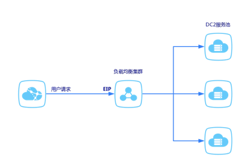

负载均衡基础架构是采用集群部署，提供四层的负载均衡，可实现会话同步，以消除服务器单点故障，提升冗余，保证服务的稳定性。

## 组成部分

负载均衡服务由负载均衡器集群和DC2服务池组成。如下图所示，来自用户的请求经过负载均衡器集群后，会根据配置的监听转发规则分发到后端DC2实例进行处理。

 

具体组件有：负载均衡实例 （Server Load Balancer Instance），监听 （Listener），后端云服务器（DC2）。

###负载均衡实例 （Server Load Balancer Instance）
使用负载均衡器的第一步是创建一个负载均衡器实例，一个负载均衡器可以添加多个监听。

###监听 （Listener）

在负载均衡实例中可以添加监听，监听指定监听规则、流量分发规则和后端rs健康检查规则。

###后端云服务器（DC2）
一组DC2计算资源池，是用户请求真正的处理节点。

##入网流量路径

对于入网流量，负载均衡会根据用户在控制台或API上配置的转发策略，对来自前端的访问请求进行转发和处理。

##出网流量路径

负载均衡SLB和后端DC2之间是通过内网进行通信的。

- 如果DC2仅仅处理来自负载均衡的请求，可以不购买公网带宽（公网IP等）。
- 如果需要直接通过后端DC2对外提供服务，或后端DC2有访问外网的需求， 那么需要相应的配置或购买公网IP等服务。
