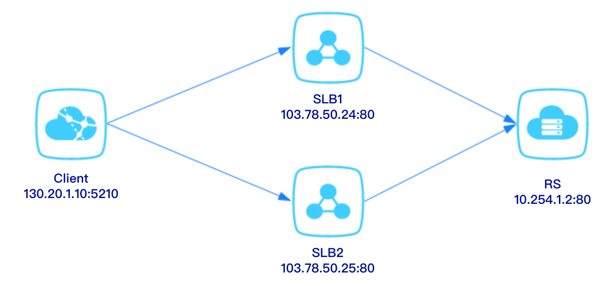

负载均衡服务支持包年包月和按时长两种计费方式。下面将为您介绍这两种方式的相关计费。

##计费方式
负载均衡服务支持预付费(包年包月)和后付费(按时长)两种计费方式。

##计费项
负载均衡目前仅支持公网+固定带宽计费模式，计费项包含 **实例配置费** 和 **公网带宽费** 。

##价格表
计费方式|实例配置费|公网带宽费
----|----|----
公网包月|10（元/月）|依据带宽【按月】标准收费；详情参考[EIP购买须知](https://help.didiyun.com/hc/kb/article/1090983/)
公网按时长|0.018(元/小时）|依据带宽【按时长】标准收费；详情参考[EIP购买须知](https://help.didiyun.com/hc/kb/article/1090983/)

##相关说明：

- 实例租用费根据负载均衡实例的类型分为公网和私网2种类型，目前仅支持公网类型；

- 公网带宽费以5Mbps为界，阶梯定价，详情参考[EIP购买须知](https://help.didiyun.com/hc/kb/article/1090983/)；

- 按小时计费，以日结算（运行未满一日，按照当日实际使用小时数 x 当日开通的最高带宽的天价格/24）。如果您使用负载均衡实例的时间不足一小时，按一小时收费。 

- 当前计费周期账单金额=当前计费周期的实例租用费+当前计费周期的最高公网带宽费；负载均衡带宽计费是按照用户开通的实例带宽规格收费，而不是按照已使用的带宽规峰值收费。例如开通了一个2Mbps的公网实例，则每个小时收取的费用为：

	0.018（资源占用费）+ 0.06(2M带宽/每小时)=0.078元。

- 账单出账时间，通常在当日计费周期结束后。 具体以系统出账时间为准, 账单生成后会自动从您的账户余额中扣除费用以结算账单。

>注意：
>>目前负载均衡不支持如下的部署方式，即同一RS（同一台DC2的同一端口，如10.254.1.2:80）挂载到两个不同的SLB listener上，如103.78.50.24:80和103.78.50.25:80。

 