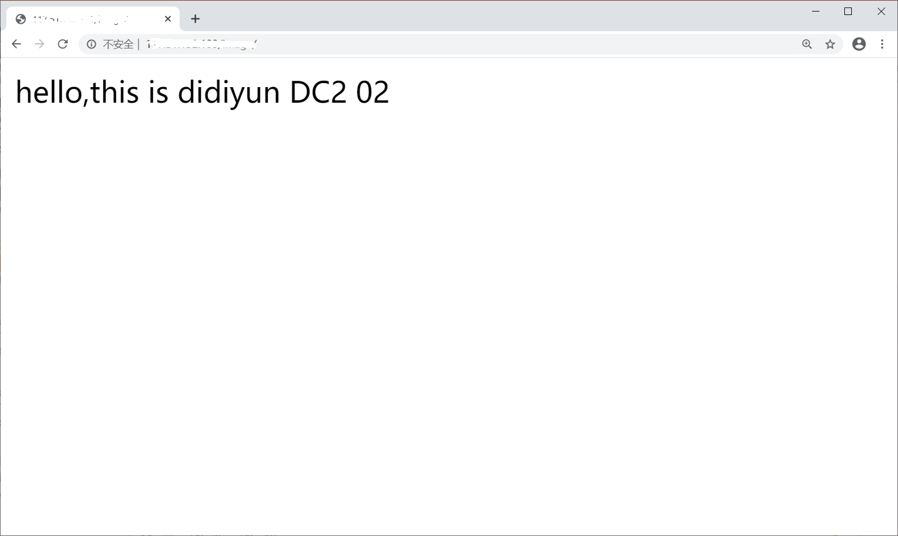
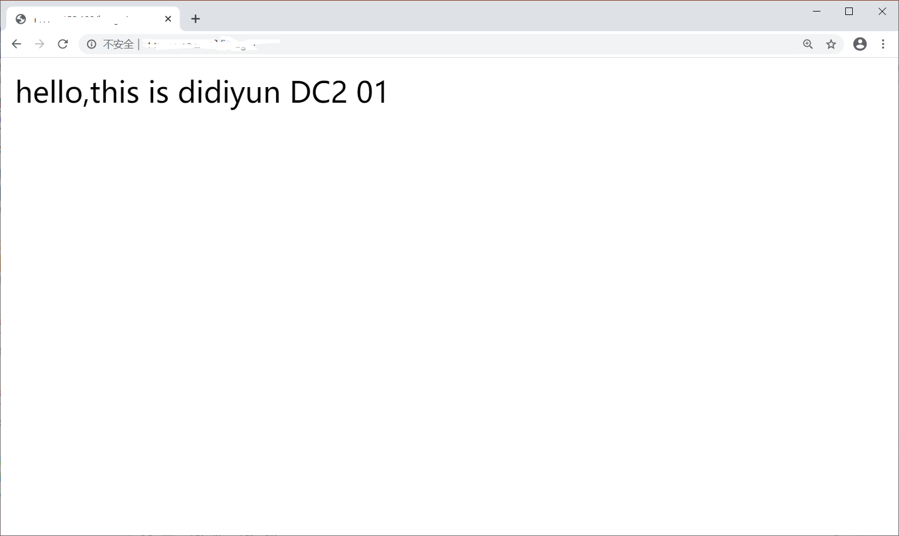

当您创建SLB后，如果您想要添加监听，您可以参看本文档来配置SLB。

##操作步骤

1. 登录到控制台，在上方导航栏单击 所有产品，单击 负载均衡（SLB），进入 负载均衡（SLB）列表页。
2. 在 负载均衡（SLB）列表页，找到想要添加监听的SLB，单击SLB名称，进入该SLB的详情页。
3. 进入到 监听tab页，单击 添加新的监听。
4. 设置监听：
	- 设置 监听器名称、监听端口和均衡算法：目前支持加权轮询、最少连接和源地址散列三种算法。
	- 设置 健康检查：设置健康检查间隔、响应超时、不健康阈值和健康阈值等。
	- 添加 云服务器：根据云服务器的对外服务能力和情况来区别设定端口和权重。
5. 单击 立刻添加，即可添加新的监听。
6. 当后端DC2的健康检查状态为正常时，表示后端DC2可以正常处理负载均衡转发的请求了。
7. 在浏览器中输入负载均衡实例的服务地址，测试负载均衡服务。

 
 

>说明：
>>设置健康检查功能后，当后端某个DC2健康检查出现问题时，负载均衡服务会将请求转发到其它健康检查正常的DC2上，而当该DC2恢复正常运行时，负载均衡会自动恢复它的请求转发。
