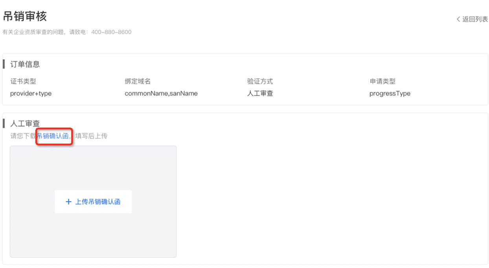
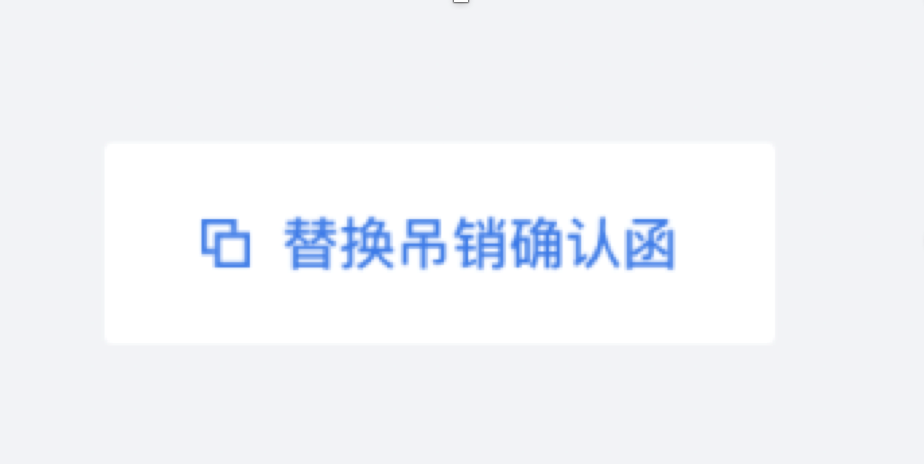

用户可上传自有证书到滴滴云上进行管理和使用（例如可用于滴滴云的SLB、WAF等产品）。
进入证书主页面，单击右上角的**"+上传证书"**按钮

目前上传的自有证书只支持PEM格式，且证书文件和私钥文件分开上传，上传方式为粘贴内容到文本编辑框，粘贴的内容要包括完整的证书和私钥内容，即必须要包括"-----BEGIN XXXX-----"和"-----END XXXX-----"，如果自有证书包含有中间证书，也需要把中间证书和证书一起上传，否则在使用过程中，可能不被浏览器支持。

证书名称用户自定义，仅支持英文字母、数字、下划线和中划线，并且要确保租户唯一。
滴滴云会对上传的证书进行正确性校验，请确保上传的证书内容正确。
已经上传的证书可在“我的证书”页面的证书列表中进行查看和管理。
上传的自有证书不允许在滴滴云上执行吊销操作。