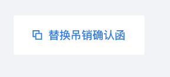
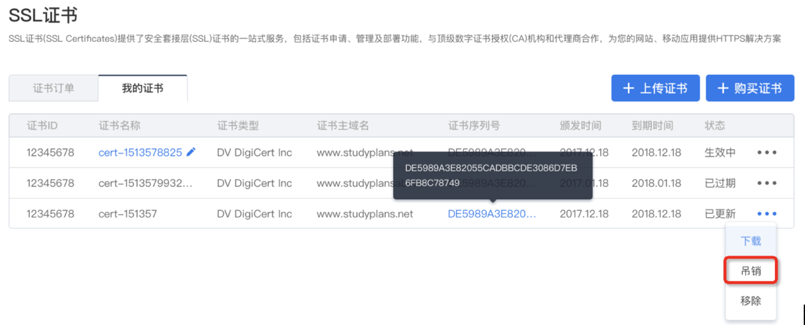
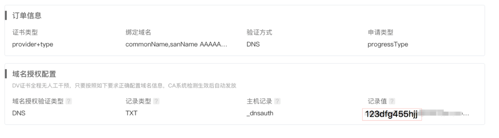
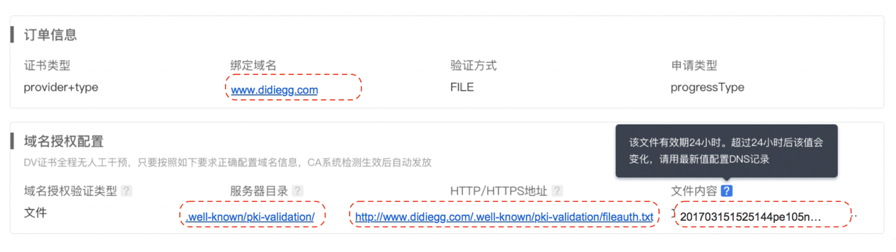

# 吊销证书
证书的吊销只能是针对已经颁发完成的证书进行，在“我的证书”页的证书列表中，单击要吊销的证书对应的**"..."**，会弹出菜单，单击**“吊销**”。

然后在“证书订单”页中的证书列表中，找到要吊销的证书，在“进度”一栏中，单击**“吊销审核”**，根据不同的证书类型，会出现不同的吊销审核页面。
证书的吊销过程和申请审核过程类似，域名型证书可通过用户配合自助完成，企业型和增强型需要提交确认函，通过人工审核完成。
## 域名型证书吊销
DNS域名验证方式

文件验证方式

详细的设置方式请参考[域名型证书授权验证方法](./域名型证书授权验证.md)。
## 企业型/增强型证书吊销

请先单击上图红框中的《吊销确认函》，如实填写完成后，单击**"+上传吊销确认函"**按钮，如果上传成功，会出现如下提示。

可重新上传《吊销确认函》，重新上传后会替换之前已经上传的确认函。