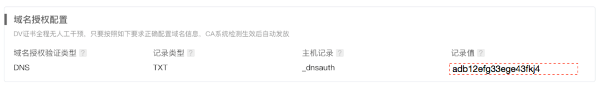
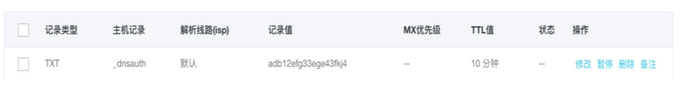

根据CA要求，申请的域名证书必须完成对所绑定域名的所有权验证。
如果信息填写完整、正确，全程自动化验证，待域名授权验证完成，CA系统检测生效后，随后即可颁发证书。
>注：
>如果提示验证失败，请检查域名是否包含敏感词，例如bank、pay等，或者域名后缀（根域名）是否为不常用词。

滴滴云域名型证书提供了两种验证方式，分别是DNS验证与文件验证。
## DNS验证
选择 DNS 域名授权验证方式，您需要到您的域名解析服务商（如万网、新网、DNSPod等）提供的系统中进行配置。
请按照滴滴云证书售卖页面中，证书申请时的提示进行添加DNS解析记录。
**举例**
滴滴云上的提示如下所示。

则需要在域名解析服务上添加如下DNS解析记录。

## 文件验证
需要用户在自己的网站目录下，上传滴滴云证书申请时提供的文件，然后CA机构会访问该目录下的文件来确认域名的所有权。
网站路径通常为：[http|https] :// (证书域名) /.well-known/pki-validation/（文件名）
**举例**
证书绑定域名为是 `www.didiegg.com`，服务目录是/.well-known/pki-validation/，文件内容为：201703151525144pe105n5erh8yf6est4att5l2kora7egwqptvinqj5wqi22ehg

那么需要访问: `http://www.didiegg.com/.well-known/pki-validation/fileauth.txt`, 同时获取到文件内容为: 201703151525144pe105n5erh8yf6est4att5l2kora7egwqptvinqj5wqi22ehg。
>注意
>- 文件验证不支持任何形式的跳转，需要直接响应200状态码和文件内容。
>- 文件内容结尾不能有回车或换行符。
