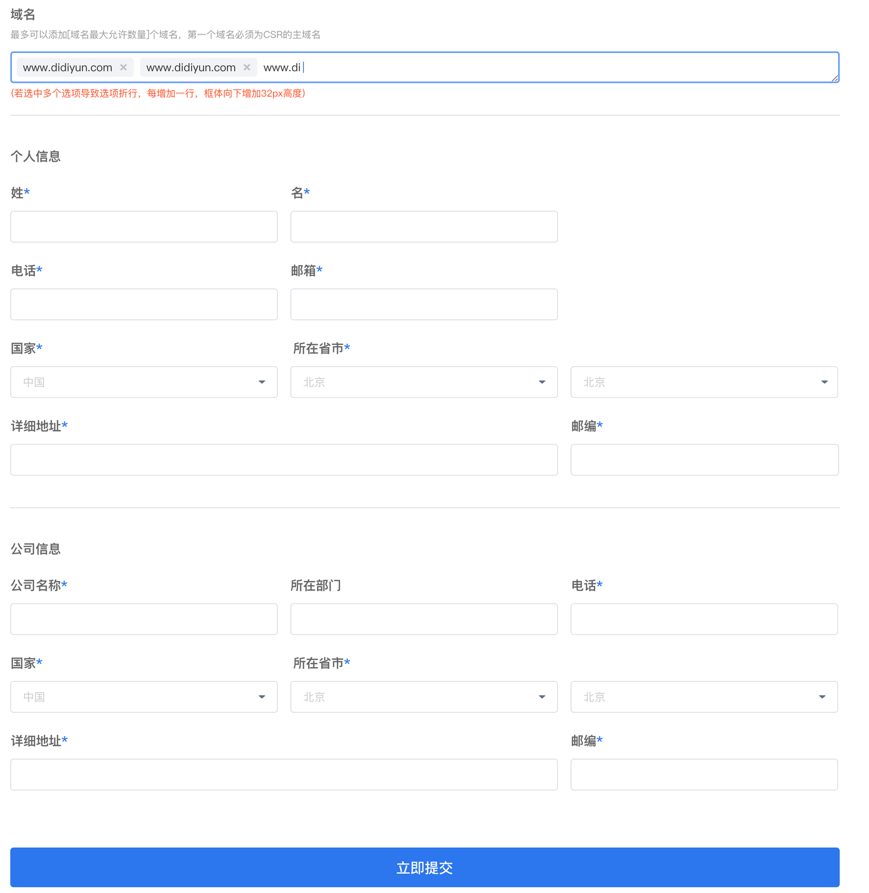
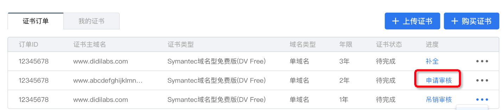
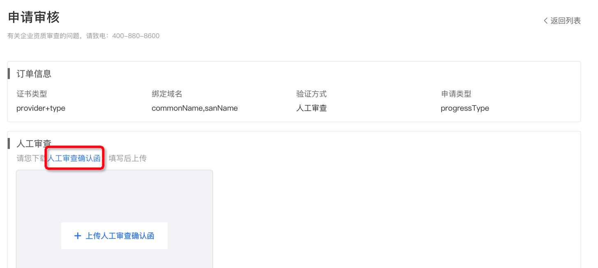

当证书信息补全以后，在“证书订单”页的订单列表中，就会出现“申请审核”，点击该链接，提交审核。

不同类型的证书审核方式不同，域名型证书可通过用户配合、自动化校验方式进行审核，但企业型和增强型必须要提交审核申请表进行人工审核。
## 域名型证书审核
请参考[域名型证书授权验证方法](./域名型证书授权验证.md)。
设置完成后，10-15分钟即可生效。
## 企业型/增强型证书审核

请先单击上图红框中的超链接下载《人工审查确认函》，如实填写完成后，单击**“+上传人工审查确认函”**，如果上传成功，则提示框中会显示“替换吊销确认函”。

这时候可以重新上传确认函，重新上传完成后，会替换原来已经上传的确认函。

《人工审查确认函》上传完成后，单击**“立即提交”**按钮，提交人工审核。

由于企业型和增强型证书需要确认组织（公司）信息，需要人工审核，所以审核周期会比较长，请耐心等待。