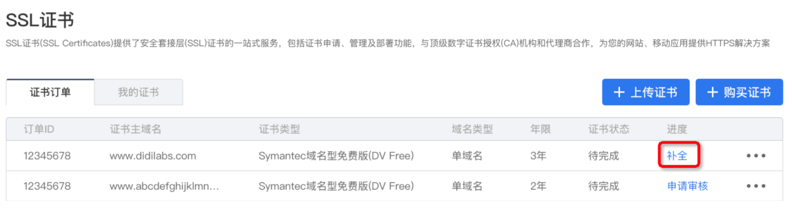
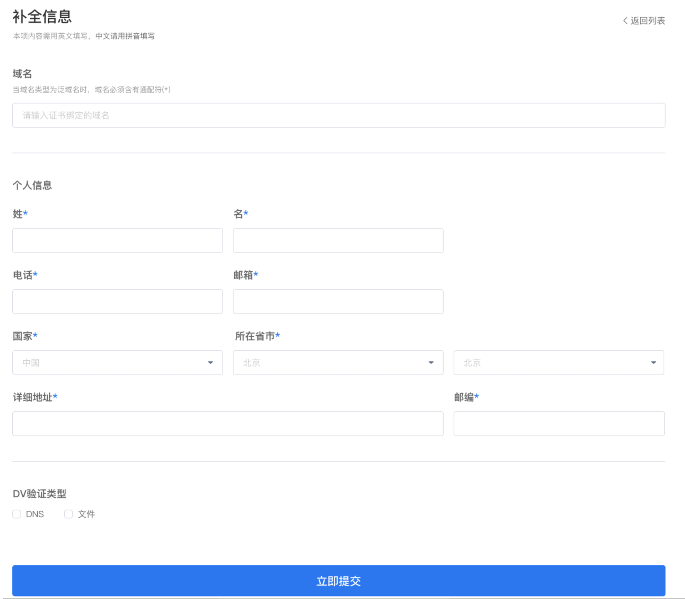

证书购买完成后，进入“证书订单”主页，在订单列表中，找到刚刚购买的证书（默认会显示在第一行），在进度列中，单击**“补全”**按钮。

根据证书类型，会出现不同的证书补全页面，下面分别说明。
## 域名型证书补全

请注意标星号字段必须填写。
个人信息部分所有文字字段必须用英文填写（中文用拼音代替）。
DV验证类型中，DNS、文件两种方式任选一种（二者的验证方法见[申请审核](./申请审核.md)）。
填写完成后，请确认所有信息无误，单击**“立即提交”**。
## 企业型/增强型证书补全

请注意标星号字段必须填写。
个人信息、公司信息部分所有文字字段必须用英文填写（中文用拼音代替），且真实有效，否则在申请审核时，可能会审核失败。
填写完成后，请确认所有信息无误，单击**“立即提交”**。
