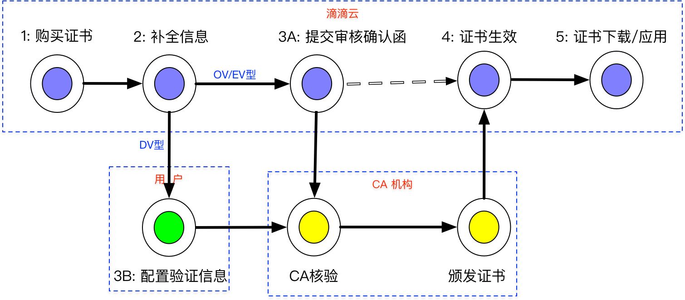
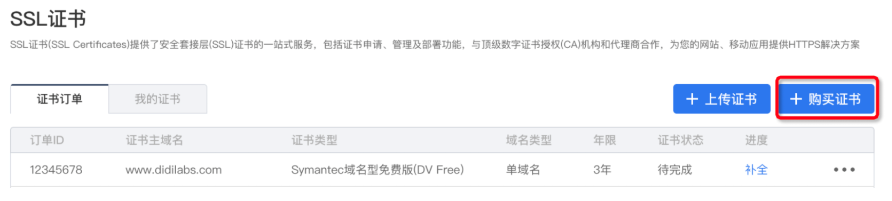
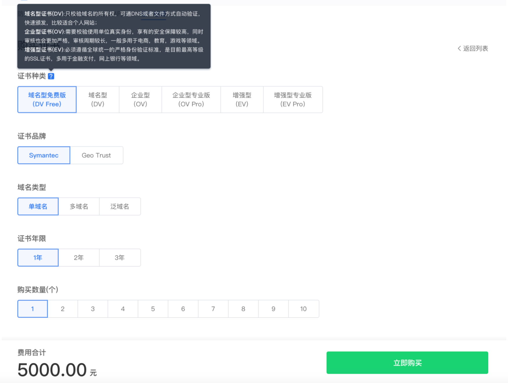

# 证书购买

>说明：
>购买证书操作实际上只是在滴滴云上生成一个证书订单，在购买操作完成后，还需要进入证书控制台“证书订单”页面补全信息。

## 证书购买简要操作流程

1. 购买证书，生成“证书订单”。
2. 填写“证书订单”中新购的证书相关信息。
3. 提交**“审核”**，如果是企业型（OV）或增强型（EV）证书，需要人工审核，执行步骤3A；如果是域名型(DV)，请执行步骤3B。
    3A. 下载**“人工审核确认函”**，填写相关信息后，上传到滴滴云，并提交审核。
   3B. 如果在“补全”信息时，选择是DNS校验，需要在DNS注册商处，修改DNS的TXT记录为“审核”时提示的信息；如果在“补全”信息时，选择是File校验，需要在网站上新增一个文件，路径及文件内容为“审核”时提示的信息。详情配置步骤请参考[域名型证书授权验证方法](./域名型证书授权验证.md)。
4. 等待CA机构进行核验（DV型自动核验、OV/EV需要人工核验），核验通过后，CA机构会颁发证书。
5. 成功颁发的证书可以在“我的证书”里查看、下载。

## 购买证书
进入证书控制台主页，单击**“购买证书”**按钮。

弹出证书规格选择页面，用户根据自己需求选择合适的证书类型及证书品牌，如果想查看相关提示信息，可将鼠标移到问号(?)上。

- 单域名是指该证书只能用于一个具体的域名，例如:blog.didiyun.com。
- 多域名是指该证书可以用于多个域名，用户可选择包含的域名个数，但域名必须是具体的域名，不允许包含泛域名。
- 泛域名是指该证书可用于次级子域名相同的所有域名，例如泛域名*.didiyun.com证书，可用于blog.didiyun.com、help.didiyun.com，但不可用于login.blog.didiyun.com。

证书年限是从CA 机构正式颁发证书时作为起始点开始算，而不是购买时下订单的时间。
证书属于预付费产品，在提交订单时，一次性扣款，请确保账号中有充足的余额。