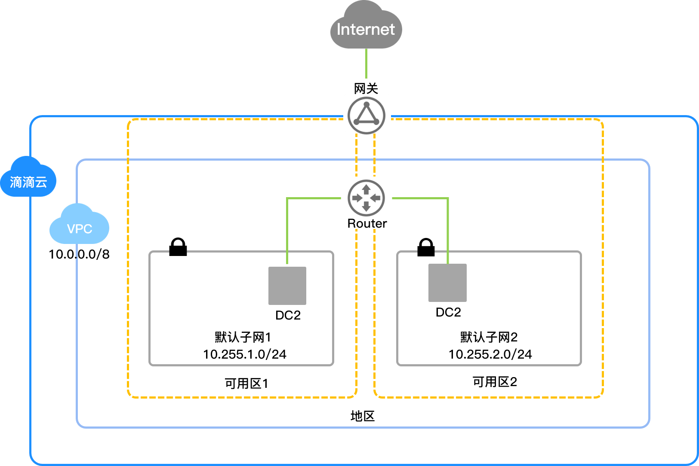

专有网络VPC（Virtual Private Cloud）提供用户安全、隔离、IP地址可自定义配置的网络环境。您可以完全掌控自己的专有网络，包括申请弹性公网IP、创建子网、设置地址范围、子网段、设置安全组策略，部署云服务器、负载均衡等云服务资源。

此外您还可以通过专线/VPN等连接方式将VPC与传统数据中心互联互通，灵活整合资源。

##组成部分
私有网络有核心组成部分：VPC网段、子网。

###VPC网段

在滴滴云创建VPC时，需要从可选的范围中指定其私有IP地址范围。

滴滴云支持使用如下VPC网段中的任意一个：

- 10.0.0.0/8

- 172.16.0.0/12

- 192.168.0.0/16

###子网

一个私有网络由至少一个子网组成，私有网络中的所有云资源都必须部署在子网内。

私有网络具有 地域（Region） 属性（如广州），而子网具有 可用区（Zone） 属性（如广州一区），您可以为私有网络划分一个或多个子网，同一私有网络下不同子网默认内网互通，不同私有网络间（无论是否在同一地域）默认内网隔离。

##主要功能
- 将一个或多个弹性公网IP地址连接到 VPC 中的某个实例，以便直接从 Internet 访问该实例。

- 将 VPC 的私有IP地址范围分割成一个或多个公有或私有子网，以便在 VPC 中运行应用程序和服务。

- 为 VPC 中的实例分配多个 IP 地址并连接多个弹性网络接口。将VPC安全组与DC2实例进行关联。

- VPC 内部通过隧道技术，使 VPC内资源都可以一跳到达，排除网络内其它一切不必要的影响因素。

- VPC 对外提供多种网络连接能力，可以根据期望的公开程度，选择不同网络连接方案：

	- 使用 EIP，可以让 VPC 内一个 IP 与公网连接
	- 使用 SNAT，可以让 VPC 内子网拥有连接到公网的能力
	- 使用 VPC 对等链接，可以让 VPC 之间相互打通
	- 使用 VPN 或专线连通，VPC 可以与用户数据中心连接，灵活部署混合云