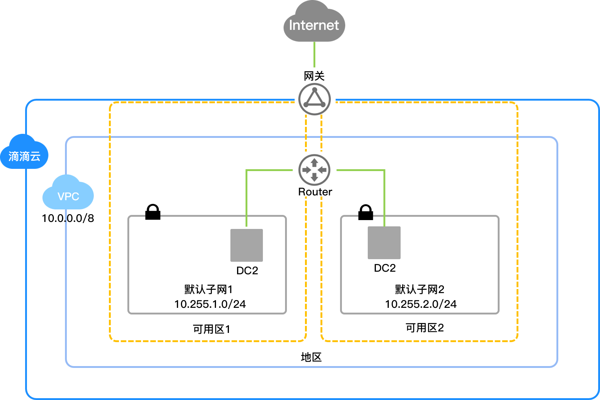

基于目前主流的隧道技术，专有网络（Virtual Private Cloud，简称VPC）隔离了虚拟网络。每个VPC都有一个独立的隧道号，一个隧道号对应一个虚拟化网络。

##背景信息
随着云计算的不断发展，对虚拟化网络的要求越来越高，例如弹性（scalability）、安全性（security）、可靠性（reliability）和私密性（privacy），并且还有极高的互联性能（performance）需求，因此催生了多种多样的网络虚拟化技术。

##原理描述
基于目前主流的隧道技术，专有网络隔离了虚拟网络。每个VPC都有一个独立的隧道号，一个隧道号对应着一个虚拟化网络。一个VPC内的DC2实例之间的传输数据包都会加上隧道封装，带有唯一的隧道ID标识，然后送到物理网络上进行传输。不同VPC内的DC2实例因为所在的隧道ID不同，本身处于两个不同的路由平面，所以不同VPC内的DC2实例无法进行通信，天然地进行了隔离。

##逻辑架构
如下图所示，VPC包含路由器、网关等重要的组件。子网和网关组成了数据通路的关键路径。整体架构里面，配置通路和数据通路互相分离。子网是分布式的结点，网关都是集群部署，并且所有链路上都有冗余容灾，提升了VPC产品的整体可用性。
