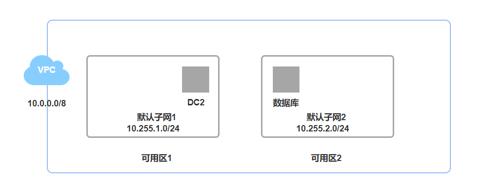
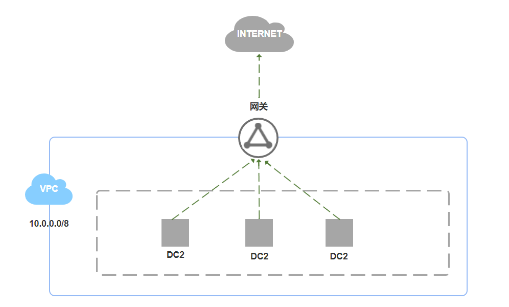
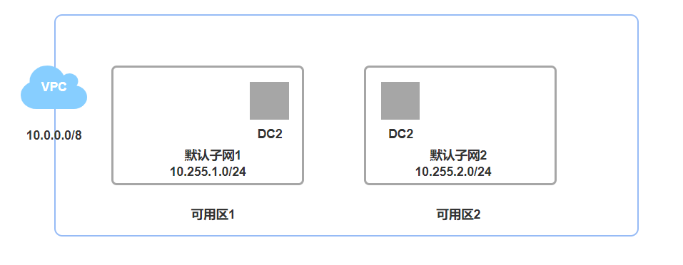
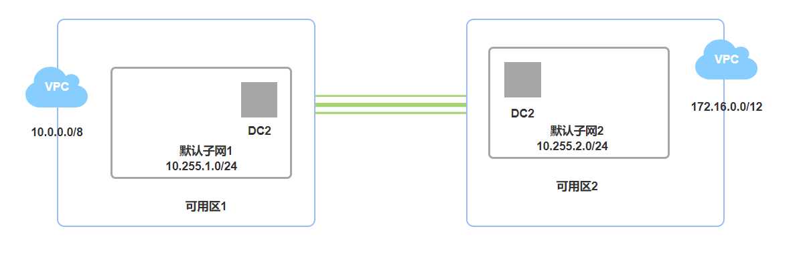

专有网络（VPC）是完全隔离的网络环境，配置灵活，可满足不同的应用场景。

##托管应用程序
您可以将对外提供服务的应用程序托管在VPC中，并且可以通过创建安全组规则、访问控制白名单等方式控制Internet访问。您也可以在应用程序服务器和数据库之间进行访问控制隔离，将Web服务器部署在能够进行公网访问的子网中，将应用程序的数据库部署在没有配置公网访问的子网中。

##托管主动访问公网的应用程序
您可以将需要主动访问公网的应用程序托管在VPC中的一个子网内，通过网络地址转换（NAT）网关路由其流量。通过配置SNAT规则，子网中的实例无需暴露其私网IP地址即可访问Internet，并可随时替换公网IP，避免被外界攻击。

##跨可用区容灾
您可以通过创建交换机为专有网络划分一个或多个子网。同一专有网络内不同交换机之间内网互通。您可以通过将资源部署在不同可用区的交换机中，实现跨可用区容灾。

##业务系统隔离
不同的VPC之间逻辑隔离。如果您有多个业务系统例如生产环境和测试环境要严格进行隔离，那么可以使用多个VPC进行业务隔离。当有互相通信的需求时，可以在两个VPC之间建立对等连接。

