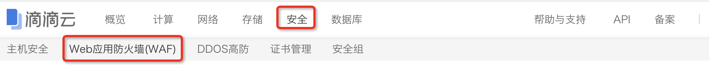
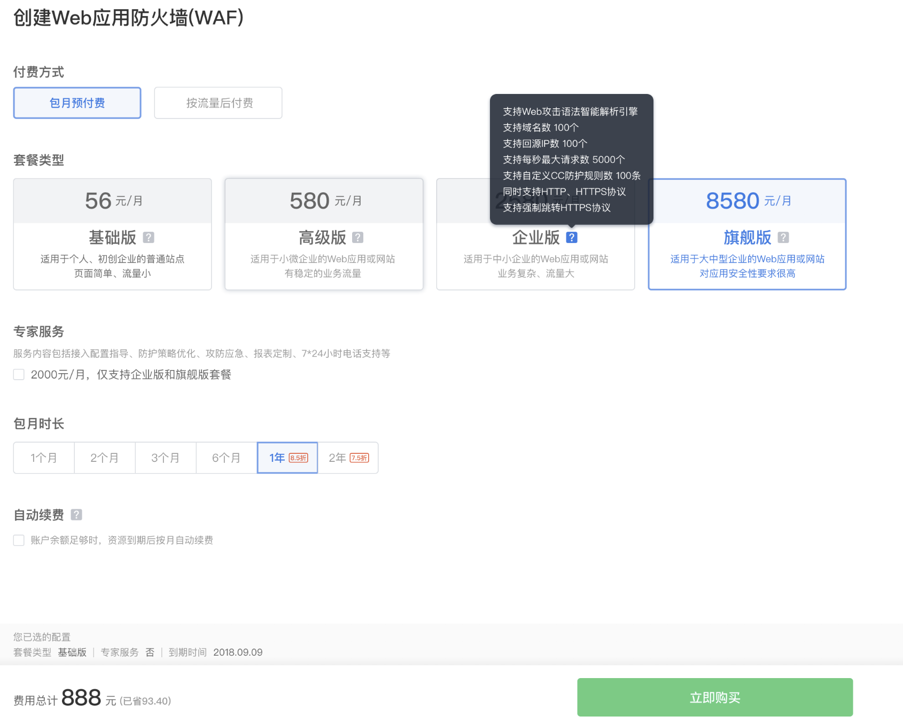

# 使用教程

使用滴滴云WAF分为以下几个步骤:

## 1. 开通WAF
如果已经开通了WAF，则可直接进入第二步。
进入滴滴云界面，在一级菜单“安全”下有“Web应用防火墙（WAF）”子菜单。

进入WAF控制台主页。

单击上图中的**“+开通WAF”**按钮，进入WAF购买页面。

WAF付费方式有两种：包月预付费、按流量后付费。

### 包月预付费开通方式
- 如果采用包月预付费，需要选择套餐类型，不同的套餐类型所支持的安全功能、承载的业务流量能力也有所不同。
- 专家服务仅提供给包月企业版、包月旗舰版套餐的客户使用，并且是单独计费。
- 如果选中自动续费，则包月到期后，会自动续费一个月，无需用户操作，但要保证账号中有足够的余额，否则会导致续费失败。 
- 确认所选择的各项参数无误后，单击**“立即购买"**，按照提示信息进行付费。
### 按流量后付费开通方式
- 按流量开通WAF无需预付费，直接单击**“立即购买”**即可，但要保证账号内不欠费，否则无法开通。
## 2. 添加域名
进入WAF控制台主页。

单击“+添加新域名”按钮，在WAF上添加新的受保护域名。

添加新的域名时，需要添加域名信息、选择服务协议、填写源站IP。
域名信息填写完成后，回车确认，后台会自动校验域名是否已经备案完成，WAF 目前只保护备案完成的域名，如果域名尚未备案，请先完成域名备案，关于域名备案的具体细节详细见[网站备案页](https://help.didiyun.com/hc/kb/category/1011103/)
协议支持HTTP、HTTPS和强制跳转到HTTPS，如果选择HTTPS或强制跳转到HTTPS，则需要上传或购买被保护域名的证书，证书上传和购买需要进入证书管理产品控制台。
源站IP支持下拉选择和手工输入，但都必须是公网 IP，多个 IP 以空格隔开，回车键进行输入确认。
上述信息填写完成以后，单击**“立即添加”**，域名列表中会显示新添加的保护域名。

如果要添加多个域名，重复上述步骤即可。
添加完域名以后，在每个域名后门都有“…”操作，把鼠标放到上面，可以显示出浮动菜单。

单击**“攻击详情”**、**“网站质量”**、**“安全策略”**可以进入该域名的WAF规则配置和查看安全日志等情况；单击**“暂停防护”**可以暂停该域名的WAF保护，在暂停状态下不影响该域名网站的正常访问，如果WAF处于暂停状态下，那么这个菜单项“停止”位置显示的是“开启防护”；单击**“删除”**则删除该保护域名。
## 3. 网站配置
在成功添加域名以后，就可以对WAF进行相关配置。单击要配置的域名进入该域名的配置页面，或者单击域名所在行对应的**“...”**，显示浮动菜单，单击**“网站配置”**进入该域名页面。

首先需要设置网站的回源IP，也即要保护的网站IP，支持多个源站IP，多源站间流量负载均衡，自动容灾。
WAF目前支持HTTP和HTTPS两种协议进行防护，用户可根据实际使用情况进行配置，当启用HTTPS协议时，需要配置被保护域名的证书。
## 4. 安全策略
滴滴云WAF默认对各种主流的Web应用攻击都提供检测识别和实时防护，Web 防护策略由滴滴云内部专业的安全运营人员维护，如果需要自定义安全策略，可选择“安全策略”Tab页，进行安全策略配置。
安全策略对执行流程为：访问者->地理区域封禁->精确防护->CC防护->Web防护->源站。

地理区域封禁支持根据IP所处地域进行访问禁止。目前可选的地域如图所示，该功能目前仅企业版及以上包月套餐支持。

精确防护策略支持 IP 黑白名单、User-Agent 黑白名单。如果一个请求同时匹配上了黑白名单规则，则白名单优先。
IP 黑白名单即支持单IP、也支持 IP 掩码方式，多个IP 或 IP 掩码以空格隔开，回车确认。

User-Agent黑白名单支持精确、 正则两种匹配方式。精确匹配是指请求中UA字段完全匹配配置的内容，包括长度、大小写、先后顺序等；正则匹配是指请求中 UA 字段满足配置的正则表达式，正则表达式需要符合 PCRE 规范。如果配置了多条规则，多条规则之间为或的关系，按照顺序进行依次匹配。
CC防护策略支持按照IP、UA、Referer对CC攻击进行统计并防护。不同计费套餐支持IP黑白名单、User-Agent黑白名单和CC规则数量不同。

Web防护策略为智能相应防护，提供三种防护方式供选择：智能防护、拦截、仅记录。智能防护为根据攻击请求危害等级、检测精准度，自动判断拦截还是放行，推荐使用方式；拦截为发现攻击请求就进行拦截，不放过任何可疑攻击，建议对安全性要求较高的网站使用；仅记录为发现攻击请求只进行事件记录，不拦截任何请求。

拦截页面设置为安全策略的高级设置，可自定义拦截页面（即攻击被拦截时返回给攻击者的页面），提供默认页面、自定义页面（文本，支持HTML、JSON和XML格式）、URL跳转（跳转域名和被保护域名不能为同一域名）三类。目前仅高级版及以上包月套餐支持。

## 5. 接入流量
在编辑完WAF策略以后，WAF就可以正常工作了，但还有一个非常关键的步骤是把要保护的域名的流量接入WAF检测。具体办法是将该域名的DNS解析为滴滴云WAF分配的的CNAME进行流量引导，原理示意图如下。

具体操作过程：在滴滴云WAF中，每添加一个域名都会自动为这个域名生成一个相应的CNAME，这个CNAME名称显示在域名下面，如下图。

将鼠标移至CNAME名称上，右侧显示复制图标，单击该图标复制，保存相应CNAME名称。
到域名服务所在提供商去修改DNS解析记录，以万网为例，例如修改域名为`didiyun.com`的CNAME解析记录，添加www和@两条CNAME记录。

其中，记录值即为前面保存的CNAME名称，TTL是域名缓存时间，如图选择10分钟，这表示修改了CNAME以后，一般要10分钟左右才能生效。添加完并启用以后，即完成接入流量的配置。
## 6. 验证WAF是否开始防护
在上述步骤配置完CNAME解析以后，在最长TTL的时间以后，流量将被WAF接管。
如有任何问题，请通过滴滴云工单系统反馈或者联系客服。