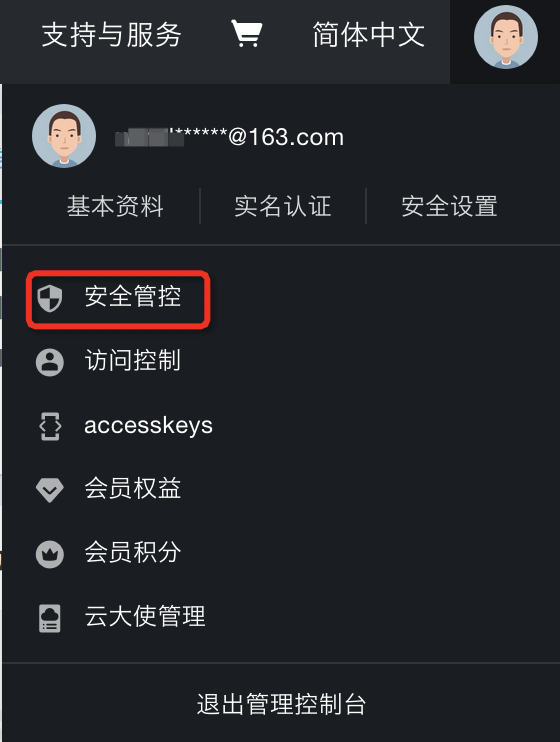
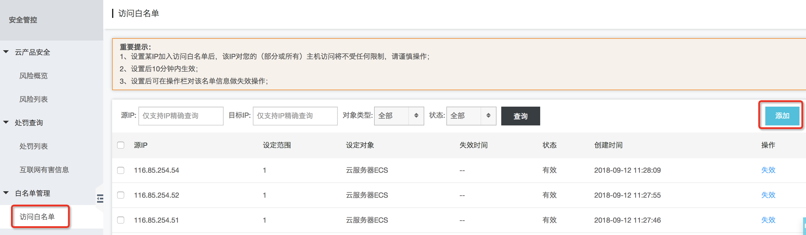
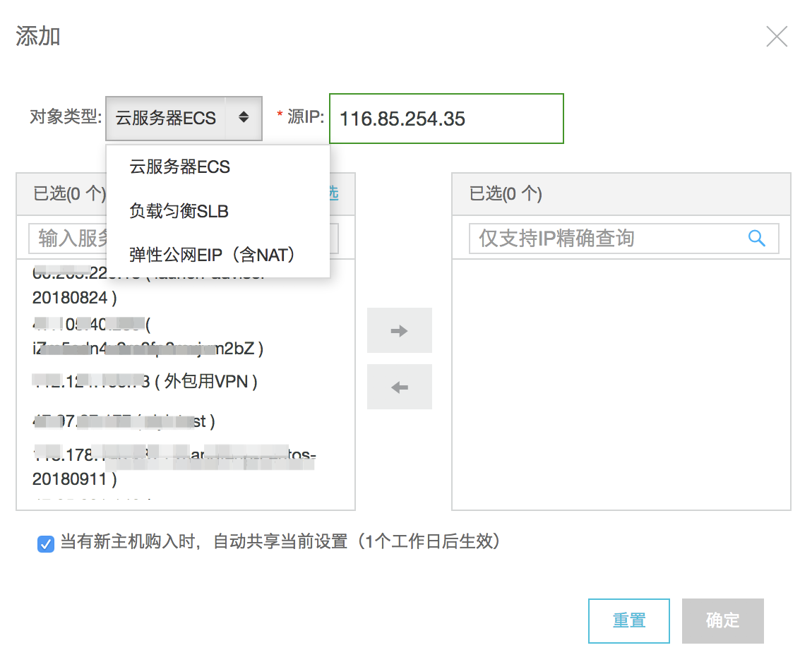

# 产品类常见问题

## Q1：WAF是否支持HTTPS？
A：支持，用户可以在证书管理控制台上传自有SSL证书或者购买新的SSL证书，并且滴滴云WAF针对HTTPS协议做了优化，默认开启了 TLS Session Ticket 复用、TLS 动态 Record Sizing 等方案对HTTPS访问进行加速。

## Q2：WAF支持哪些攻击检测？
A：滴滴云WAF对各种主流的Web应用攻击都能进行精确识别和实时防护，保障用户业务安全，滴滴云WAF可以检测如下类型的攻击：SQL注入攻击、XSS攻击、CSRF攻击、SSRF攻击、Webshell后门、弱口令、反序列化攻击、代码注入、文件包含、XML实体注入、XPATH注入、LDAP注入等常见攻击类型。

## Q3：添加了防护域名以后网站就得到保护了吗？
A：还不能，还需要把网站的流量引导到滴滴云WAF，滴滴云WAF采用CNAME方式进行引流，需要用户手工把网站的DNS记录修改为WAF为保护域名分配的CNAME，详细见用户帮助文档说明。

## Q4：WAF 的防护域名是否支持泛域名？
A：暂不支持，正在开发中。

## Q5：我的一级域名下面有多个子域名，应该如何配置 WAF 防护域名？
A：需要将所有需要 WAF 保护的域名都配置进来，并且要填写完整的子域名，暂不支持泛域名（即将支持）。

## Q6：每个用户可添加的域名有限制吗？
A：有限制，按流量计费目前最多支持10个域名，包月计费根据套餐类型不同，支持的域名数也不同（从10到300个），如果需要添加更多保护域名，请购买更高规格的包月套餐。

## Q7：我的Web服务不在滴滴云上，我能使用滴滴云WAF吗？
A：可以，在配置 WAF 时，将源站 IP 填写为Web 服务器对外服务的公网IP。

## Q8：我使用WAF以后怎么停止WAF？
A：如果是暂时不用，可以对保护的域名做“停止”操作；处于停止WAF保护状态下的域名的流量将不会被统计和计费；如果是永久不用WAF，则可以先把该域名的DNS记录修改回原来的记录，然后删除WAF上的对应保护域名。

## Q9：如果在WAF中配置了HTTPS协议，那么源站是否仍需要配置HTTPS？
A：不需要，如果在WAF中配置了HTTPS防护，那么源站只开启HTTP协议即可，不需要再配置HTTPS服务（目前暂不支持HTTPS方式回源）。

## Q10：使用 WAF 时，域名是否需要在滴滴云进行备案？
A：域名只需要在工信部备案过（通过其它云平台）即可，不强制在滴滴云备案，但如果在滴滴云做过域名备案，则 WAF 在检查备案信息时，会更高效一些。

## Q11： WAF是否支持防CC攻击？
A：支持，除了防CC攻击，还支持峰值流量限流功能，防止网站被突增流量冲击而无法正常提供服务。

## Q12: 滴滴云WAF的出口IP有哪些？
A：116.85.254.35、116.85.254.36、116.85.254.37、 116.85.254.51、116.85.254.52、116.85.254.53。
如果在源站上设置了某些安全策略，建议将上述WAF的出口IP添加进白名单。

## Q13：使用WAF 后，为什么有时候会返回一些502错误？
A：502错误一般是源站不响应WAF 的反向代理请求导致的，如果频繁出现502错误，建议从以下几个方面去检查：
- 源站服务器上如果安装有安全防护小工具（例如安全狗、云端安骑士、冰盾、云锁等），请将 WAF 的出口 IP加到白名单中。
- 源站服务器上如果配置了防火墙限速规则（例如 Iptables），请将来源 IP是WAF 的出口 IP的规则取消限速。
- 如果源站 WebServer（例如 nginx、tomcat等）设置了单 IP 限速，请取消限速或者将 WAF 的出口 IP 加入限速白名单。
- 如果源站响应时间较长，请优化源站性能。

## Q15: 我源站在阿里云上，使用滴滴云WAF后，访问会随机出现502错误，如何解决？
A：需要将滴滴云WAF的机房出口IP加到阿里云的访问白名单中，添加步骤如下。
1. 首先使用阿里云的主账号登录阿里云控制台（也可使用阿里云子账号登录，但子账号必须要能够管理阿里云相关服务器和IP资源），点击登录阿里云。
2. 可通过如下快捷方式进入“访问白名单”配置页，也可以按照如下步骤进入访问白名单配置页。
2.1.  进入阿里云控制台，鼠标移动到最右上的账号头像上，会出现如下所示菜单。

2.2.  单击上图红框中的“安全管控”，进入安全管控配置页，打开左侧的菜单栏，单击菜单栏的“白名单管理”->"访问白名单"项，进入访问白名单添加页。

3.	单击上图的“添加”按钮，弹出添加窗口。

4. 在“对象类型”里选择提供源站服务的类型，如果源站公网IP绑定在单台ECS，则选择“云服务器ECS”；如果源站公网IP绑定的是负载均衡，则选择“负载均衡SLB”。
5. 在“源IP”框里，填入WAF的出口IP，每次只能填写一个IP（WAF的出口IP为：116.85.254.35、116.85.254.36、116.85.254.37、116.85.254.51、116.85.254.52、116.85.254.53、117.51.129.128/25）。
6. 在左侧的“实例”栏里选择源站服务的实例，单击中间的“箭头”，移到右侧的“已选”栏里（支持多选）；
7. 单击右下角的“确定”按钮完成添加；
8. 循环操作3-7步，完成所有WAF出口IP的添加（为了使以后的新购主机默认使用这些IP白名单，建议勾选添加窗口内最下方的“当有新主机购入时，自动共享当前设置”选项）。

