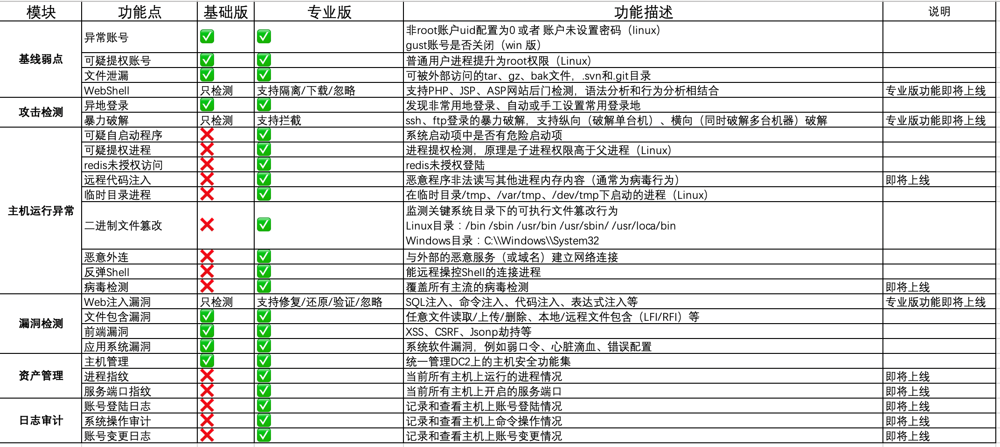

## 概述
主机安全产品是滴滴云推出的一款全面防护主机终端安全的产品，以滴滴安全积累的大量数据及规则为基础，通过在主机上安装轻量级的客户端，依靠强大的后台运算模型对各种黑客攻击、主机弱点、主机漏洞进行风险预警，实时的保护主机的安全运行。
其核心功能包括:

- **系统和应用漏洞检测**：包括各种操作系统漏洞和应用软件漏洞。
- **安全配置基线检测**：包括各种不安全或者错误的配置信息。
- **Webshell检测和防护**：包括各种网站后门、网页挂马的检测。
- **暴力口令破解检测和防护**：基于高效的检测规则，实时的发现账号暴力破解攻击。
- **异地登录检测和防护**：对于非常用地的登陆信息实时采集并告警。
- **主机异常检测**：实时发现主机上运行的恶意程序、外链、反弹shell等异常行为。

主机安全产品以细粒度的检测方式实时的保护主机安全，轻量级的客户端严格控制对主机资源的占用（CPU正常占用低于1%、内存占用低于80M），对用户的业务透明化，影响极微小。

主机安全产品分为基础防护版和专业防护版，用户安装主机安全客户端后，一般默认会启用基础防护版。
## 基础防护版
- 默认开通，免费使用。
- 基础防护版提供最基础的安全检测能力，功能主要包含各种系统和Web漏洞、网站后门、暴力破解和异地登录、主机基线风险、基线弱点发现等检测功能。

## 专业版
- 由用户手工开通（在资产管理页面开启专业版功能、购买DC2时开启专业版功能）。
- 付费使用，目前按实际使用时长进行计费。
- 专业防护版包含基础防护版的所有功能，并且提供更为高级的主机异常、非法外连、挖矿进程等检测能力，还针对部分漏洞和风险提供一键修复的功能（漏洞修复功能待上线）。

## 基础版和专业版功能规格

目前支持的操作系统包括：CentOS、Ubuntu、Windows。