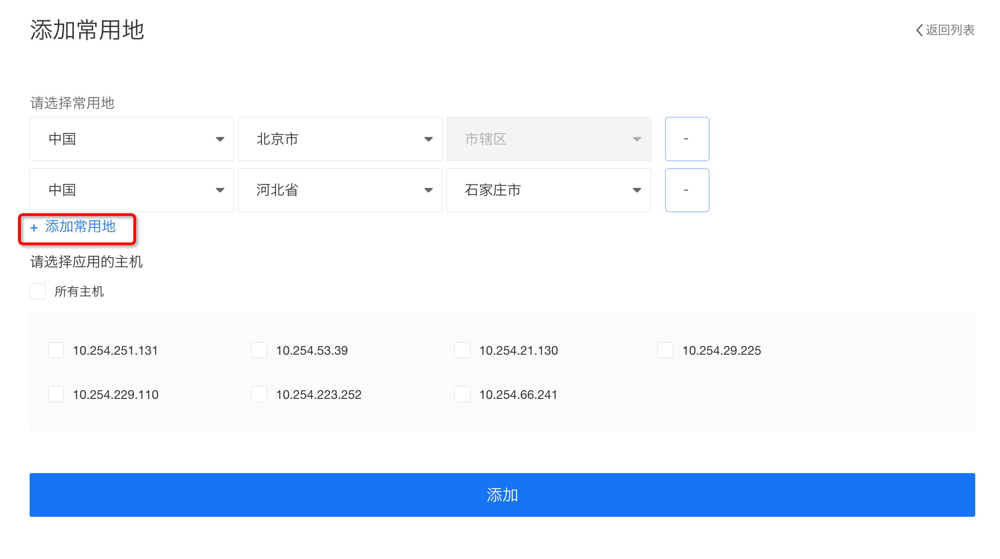

# 使用教程

## 简略步骤
主机安全产品的简要使用流程如下所示。


1. 安装主机安全客户端（DC2创建时会默认安装）， 安装方式参考[客户端安装指导](./客户端安装指导.md)。
2. 可选步骤，如果需要更全面的主机安全防护，可开启专业防护功能。
3. 成功安装主机安全客户端的DC2处于安全防护状态。

## 详细说明
### 安装主机安全客户端 
使用主机安全产品，必须在DC2上安装主机安全客户端（Agent）才能生效。
在DC2创建时会默认加载主机安全客户端，为主机提供基础安全防护。
如果在DC2运行过程中，不小心卸载了主机安全客户端，则可按以下说明重新安装主机安全客户端。
CentOS和Ubuntu安装说明；
SSH登录DC2主机，执行如下Shell命令：

```shell
curl -sL http://mirrors.intra.didiyun.com/secure_source/agent_install.sh | sudo bash -
```
详细的安装步骤请参考:[主机安全客户端安装指导](./客户端安装指导.md)
### 开启或关闭专业防护
已经成功安装Agent的DC2主机，可以在滴滴云控制台上，根据业务情况，开启或关闭某一台主机的专业防护功能（只有开启专业防护功能，才会计费）。
进入主机安全主页，选择资产管理，如下所示。


根据服务器IP/主机名，选择需要操作的主机，单击开启或关闭专业防护。
也可以选择列表最左侧的复选框，单击左上角的开启专业防护、关闭专业防护按钮，执行批量操作。
>注：<br>
>控制台上的操作和实际的开启或关闭生效有短暂的时间延迟，如果状态更新延迟，请耐心等待。

### 查看主机安全详情
已成功安装主机安全防护Agent的主机，可以单击最右侧的**“安全详情”**查看主机安全详情。


详情包括主机威胁风险总览、主机基本信息和具体的威胁风险信息，还可以对威胁进行处理。
威胁风险信息一共十项，包括：系统漏洞、Web漏洞、账号弱口令、基线弱点、异地登陆、暴力破解、网站后门、主机异常、病毒查杀、文件篡改。
其中系统漏洞、账号弱口令可在详情中查看**“修复建议”**。

Web漏洞、基线弱点、网站后门、主机异常、文件篡改可在详情中进行“修复“、”回滚“、”验证“、”忽略”操作。

病毒查杀可在详情中进行“隔离“、”忽略”操作。

### 资产管理
已有主机开启主机安全防护，可在资产管理中进行账户、端口和进程的查看。


### 风险发现和入侵检测
已有主机开启主机安全防护，可查看所有已开启防护的主机的风险发现和入侵检测情况，并进行相应的操作。


### 卸载主机安全客户端
不建议用户自行卸载主机安全客户端，如果需要关闭安全防护功能，可以通过控制台关闭一台或多台主机专业防护功能。
目前只提供通过滴滴云控制台进行卸载，进入主机安全主页，选择资产管理，如下所示。

选择需要卸载客户端的主机，单击最右边的**“...”**，弹出操作菜单，单击**“卸载”**，填写卸载原因。

>注:
>对于已经卸载客户端的主机，无法在“资产管理”的主机列表中看到，如果需要启用主机安全防护，则必须重新安装主机安全客户端。

### 设置常用登陆地
系统会自动记录并学习主机的常用登录地，当发现某次登录来源不是常用登录地时，会进行异地登录告警。
对于需要多地登录的主机，可通过手工设置常用登录地，避免误报。
进入主机安全主页，单击**“设置”**，如下所示。

单击**“添加常用地”**，出现登录地设置页面。

可以选择一个或多个常用地，并且应用的主机列表，单击**“添加“**，设置完成。
>注：
>如果主机设置了常用登录地，则后续的所有登录和设置的常用地不一致，均认为是异地登录。


