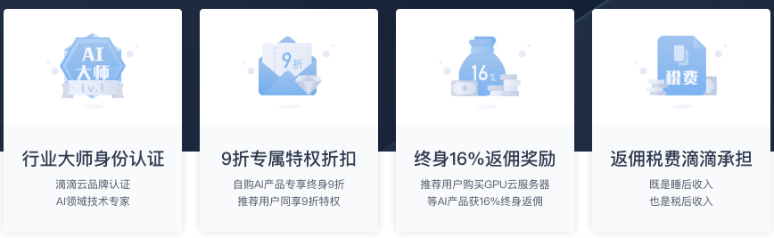
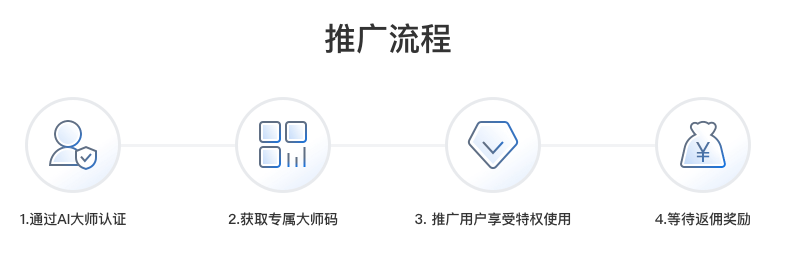

##滴滴云AI大师简介
滴滴云AI大师是滴滴云生态战略合伙伙伴，致力于帮助更多中国中小企业及个人完成数字化转型和信息化升级。

滴滴云AI大师通过分享专属大师码邀请企业或个人购买滴滴云AI产品，被邀请的个人或企业完成注册及实名认证后成为滴滴云用户，AI大师邀请的用户以现金的形式购买滴滴云AI产品，AI大师即可获得相应的现金奖励。

##AI大师有什么权益？
滴滴云用户使用AI大师的大师码购买/续费/调配滴滴云AI产品享9折优惠，该AI大师可获得用户消费金额的16%作为现金返利。

##AI大师可推广滴滴云的哪些产品？
AI大师目前可推广的滴滴云产品有：GPU云服务器产品、vGPU云服务器产品、机器学习工作室（DAI）。

##如何成为AI大师？
滴滴云AI大师目前采用邀请制，若您有意申请成为滴滴云AI大师，请联系滴滴云客服。

##如何推广滴滴云AI产品？

滴滴云AI大师通过大师码推广滴滴云AI产品，AI大师码是用户获得AI大师活动折扣以及AI大师获得推广返利的唯一凭证。

您可通过以下方式但不限于以下方式推广滴滴云AI产品：

1. 将AI大师活动说明及AI大师码附加到您在社区发布的文章中；

2. 通过录播视频或直播的方式透出滴滴云AI大师码

举例：

在文章合适的位置加上"用我的AI大师码xxxx在滴滴云上购买GPU/vGPU/机器学习产品可享受9折优惠，点击www.didiyun.com前往滴滴云官网."

##AI大师可以使用自己的大师码吗？
可以使用，可享受AI大师活动折扣，同时获得返利。

##受邀用户下单时使用了代金券抵扣，AI大师能得到奖励吗？
奖励只计算现金支付部分，除去代金券、商品券等优惠的现金支付部分可以得到奖励。

##如何查看我推广的效果？
通过滴滴云AI大师控制台（即将上线）可查看AI大师推广的用户数、应当获得的返利金额等信息。

##如何提取返利奖励？
登录滴滴云控制台-申请提现-填写提现的相关信息-预计7个工作日内到账

（请注意：若没有完成实名认证，则无法开始返利核算，完成实名认证后次月开始后第5日开始核算）

举例说明：

1. A用户11月份参与返利活动；

2. 12月5日之后A用户可以在控制台申请提现，填写银行信息；

3. 申请提交后预计7个工作日内将完成打款。

##在哪儿进行银行卡绑定？
登录控制台AI大师控制台页面，点击“绑定银行卡”即可进行银行卡绑定。

需注意具体到支行，并且填写准确银行及支行信息，否则影响打款到账。

##什么时候可以申请提现？申请以后多久可以到账？
当月用户发生的推荐订单，将于次月开始后第5日申请提现，一般于7个工作日内到账。

再次提醒必须进行实名认证后方可进行提现申请。

##什么是可提取奖励？可提取奖励是怎么计算的？
“可提取奖励”是指核算完成可立即提取的返佣奖励（绑定银行卡方可申请提现）

##返利金额是否需要提出税费？
滴滴云AI大师的推广返利税费由滴滴代为缴纳，如有变动以最新政策为准。