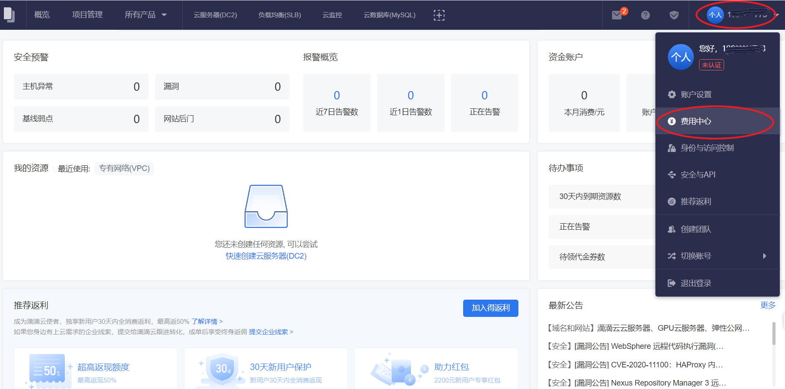

##费用中心
滴滴云费用中心为用户提供基于页面的云产品交易和账单管理能力，您可以通过费用中心清晰的了解自己的账户、账单、续费和退订等相关信息。
##功能介绍
滴滴云费用中心为用户提供以下功能：

- 消费概览：帮助您对账户余额、可用代金券、可开发票金额、月消费费用分布和历史消费等方面进行概览。
-  收支明细：用来记录账户每一笔资金的收入和支出的流水。
-  资源账单：用来记录账户使用资源对应的扣费详情。
-  导出记录：支持对您的收支明细和资源账单导出下载。
-  续费管理：对相应资源的续费操作进行管理。
-  退订管理:购买指定的云服务器可享受“7天无理由退订服务”，不符合无理由退款的情况需按《退订规则》收取手续费。

##操作步骤
1. 登录[滴滴云控制台](https://app.didiyun.com/#/)
	- 输入用户名和密码。
	- 点击“登录”。
2. 进入费用中心
	- 单击右上角用户名。
	- 在浮动窗口单击 **费用中心**。

 