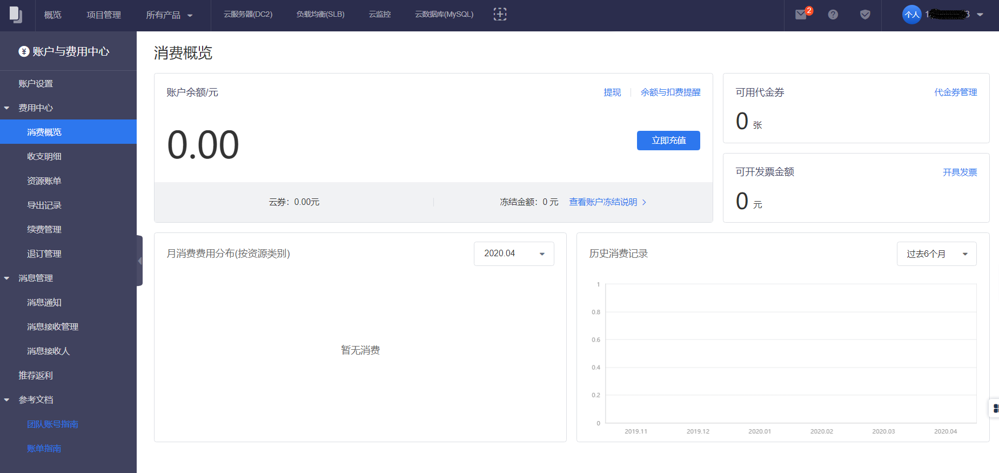

消费概览对您的账户资金、代金券、可开具发票金额、月消费费用分布和历史消费记录进行展示，方便您进行查看。

##功能介绍
###账户余额
为您提供查询账户余额、云券和冻结资金的功能。

###充值
提供支付宝、微信到账户余额的线上充值服务。

提供转账或者汇款来进行对公转帐服务。

###设置余额与扣费提醒
选择提醒范围，并开启短信提醒。

扣费或余额提醒开启后，提醒会以短信形式发送至您的注册手机，每日仅发送1次提醒。

###可用代金券
显示您目前可用代金券数量。

###可开发票金额
显示您目前可开票总额。

###月消费费用分布
可以选择某个月份，查看各个资源类别的月消费金额和占比。

###历史消费记录
以自然月为维度，统计用户在该月的消费情况，以及过去一段时间内（3个月 / 6个月 / 1年）的历史消费记录。

- 预付费资源：当月购买预付费资源的总费用。

- 后付费资源：当月购买的后付费资源的费用总和（按计费周期统计）。

##操作步骤
1. 进入费用中心
	- 单击右上角用户名。
	- 在浮动窗口单击 **费用中心**。
2. 单击左侧导航栏的 **消费概览** 。

 