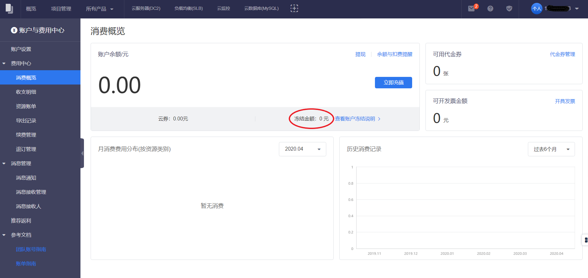

开通按时长计费（后付费）资源时，系统根据业务结算周期和周期内资源费用，对账户可用余额进行冻结。冻结的金额仍然可以作为账户余额，在结算周期后用于本周期费用扣除。当用户新创建按时长计费的产品时，账户余额需要大于之前冻结的金额和本次新冻结金额才能允许创建。

##常见问题
###Q1如何查看冻结的金额？
在费用中心的 消费概览 即可查看。

 

###Q2冻结的费用是否被平台收取？

冻结的费用并没有被平台收取，且能作为账户余额在结算周期扣除。当用户删除该资源或者调整付费方式（如包年/包月）时，该部分冻结金额将解冻。

###Q3调整资源配置后，冻结金额如何处理？

调整资源配置后，系统将自动冻结一个周期内的差价。

如：低配置资源冻结金额10元，高配置资源需要冻结20元，则需要重新冻结20-10=10元。

###Q4创建按时长产品时明明余额足够，但是不允许创建怎么办？

可能是由于账户可用于冻结的金额不足，冻结金额可以在“账单”页查看，充值完成即可新建资源（充值金额>=账户余额+新资源一周期内费用-账户冻结总额）。

如：账户余额50元，账户冻结总额45元。若新资源一周期内费用为20元，则需要充值：50+20-45=25元。

###Q5资源删除后，冻结的费用会返还吗？

冻结的费用将在一个结算周期（不同产品的结算周期略有不同）后解冻，系统会有些许延迟，请耐心等待。如有任何问题，请前往滴滴云官网提交[工单](https://help.didiyun.com/hc/request/new/)，或致电官方客服4000-590-666。