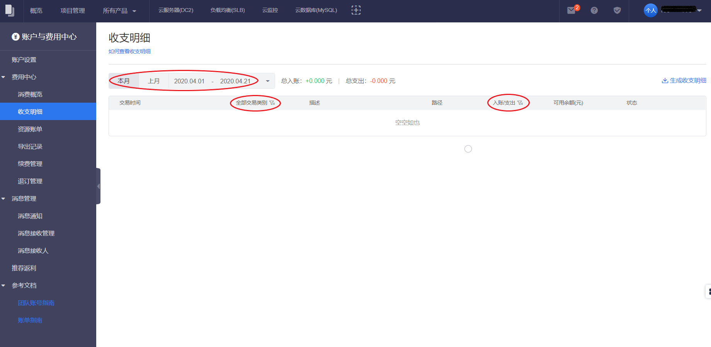

收支明细用来记录账户每一笔资金的收入和支出的流水，包括入账和支出两种类型的流水。

##操作步骤

1. 进入费用中心
	- 单击右上角用户名。
	- 在浮动窗口单击 **费用中心**。
2. 单击左侧导航栏的 **收支明细**。
3. 目前支持以下筛选方式：
	- 按时间筛选：单击本月、上月，可查看相应时间段内的收支明细记录。也可以自定义选择一定的时间范围（目前仅支持查看过去3个月的收支明细记录），查看该时间段内的收支明细记录。
	- 按交易类型筛选：单击交易类型，可以选择查看充值、提现、扣费、退款等类型的收支明细记录。
	- 按账户入账/支出筛选：单击 入账/支出 ，可以选择查看入账/支出、入账或支出的收支明细记录。
4. 单击 **详情** 可以查看该条明细的详情记录。

 