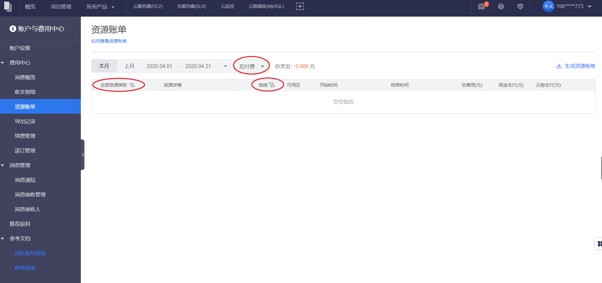

资源账单是用来记录账户使用资源对应的扣费详情，资源账单记录的是资源扣费月份。

##结算规则

根据付费模式，分为每月购买的预付费资源和每月结算的后付费资源。

后付费资源以实例维度、按月合并展示当月扣费记录，并提供报表查看用量详情，记录中的费用：月结资源为上月使用的费用，日结的资源为上月最后一天至本月倒数第二天使用的费用，小时结的资源为上月最后一小时至本月倒数第二小时使用的费用。

<table><thead><tr class="firstRow">
<th>
&nbsp;示例
</th><th>
&nbsp;描述
</th></tr></thead><tbody><tr><td>每月购买的预付费资源&nbsp;
</td>
<td>假设10月资源账单里预付费资源，展示为10月1日-10月31日内购买的预付费资源&nbsp;</td></tr><tr><td>&nbsp;每月结算的后付费资源</td><td>
假设10月资源账单里后付费资源

月结资源：展示为9月1日-9月30日内使用的后付费月结资源

小时结资源：展示为9月30日23:00-10月31日23:00内使用的后付费小时结资源

当后付费资源发生结算延迟时，上述时间可能不完全准确。&nbsp;假设10月31日22:00后的小时结资源延迟结算，10月的资源账单中，后付费资源展示为9月30日23:00-10月31日22:00的后付费小时结资源。&nbsp;

</td></tr></tbody></table> 

##操作步骤
1. 进入费用中心
	- 单击右上角用户名。
	- 在浮动窗口单击 **费用中心**。
2. 单击左侧导航栏的 **资源账单** 。
3. 目前支持以下筛选方式：
	- 按时间筛选：单击本月、上月，可查看相应时间段内的资源账单记录。也可以自定义选择一定的时间范围（目前仅支持查看过去3个月的收支明细记录），查看该时间段内的资源账单记录。
	- 按预付费/后付费筛选：在下拉菜单选择预付费或者后付费，可以显示对应类型资源账单记录。
	- 按资源类型筛选：单击全部资源类别，可以选择查看云服务器、云盘、快照等类型的资源账单记录。
	- 按地域筛选：单击地域，可以选择全部地域、北京和广州的资源账单记录。
4. 单击 **详情** 可以查看该条明细的详情记录。

 