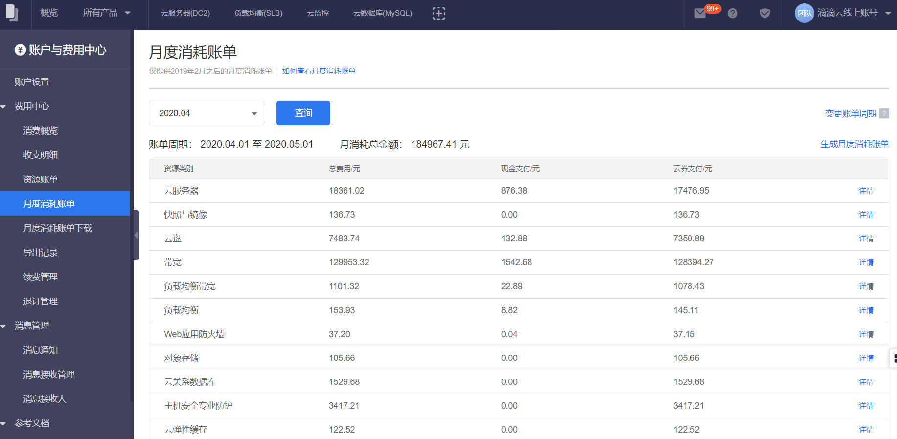

##使用说明
用户可以使用月度消耗账单来观察每个月的成本消耗总额，以及基于资源种类和特定资源来看分摊情况。

月度消耗账单按照计费周期，以资源类型和资源进行汇总，即统计用户已购买的资源种类的月度消耗总额，以及资源种类下所有资源的月度消耗金额。

对于预付费消费而言，月度消耗账单仅统计该资源在本月实际产生的消耗。例如，包年包月购买的资源，如果在本月实际使用天数不超过30天，则本月消耗金额的计算方式为：（本月使用天数／总购买天数）*购买总金额。

对于后付费消费而言，月度消耗账单统计的是该资源在本月实际使用产生的消耗。例如，对于按小时计费的按量计费资源，在8月31日23:00-23:59产生的消耗，实际扣费时间在9月1日，按计费周期来统计，该记录会归属到8月账单。

##账单周期
默认账单周期为每个月1日00:00:00至下个月1日00:00:00，最后一天23:00:00-23:59:59的消耗也会计算在本月账单中。用户可以根据自己财务日期调整出账日期，比如将账单周期调整为每月5日，则下个月的账单将从5号开始统计。

最晚调整账单周期的时间是当前账单周期结束日期的23:59:59 。设置新的账单日期会影响本月的账单结束时间，例如用户在8月20号将账单周期调整为每月5日，则8月份的账单将统计8-1 00:00:00 至 9-4 23:59:59的消耗，9月份的消耗账单将统计9-5 00:00:00至10-4 23:59:59的消耗。账单周期的调整不会影响之前已经生成的账单，并将在下月生效。

每个月的月度消耗明细会在账单截止日期3天后提供下载，用户可以下载。

##操作步骤
1. 进入费用中心
	- 单击右上角用户名。
	- 在浮动窗口单击 **费用中心**。
2. 单击左侧导航栏的 **月度消耗账单**。
3. 单击右上角 **变更账单周期** ，可以设置新的账单周期。

>说明
>>新的账单日期将在下个月生效，且不会影响之前已经生成的账单。

##与资源账单的区别

  |资源账单|	月度消耗账单
-----|-----|------
统计周期	|自然月或用户选择的特定时间段（不一定是整月）	|每月X日，默认每月1日，周期总是整月
统计维度|	单个资源维度	|一级汇总：资源种类；二级汇总：单个资源
预付费资源	|预付费资源的消费记录仅出现在购买所在月份的资源账单中	|不管预付费资源是否为本月购买，只要它在选定月份中还在使用/有消费，则会出现在该月的月度消耗账单中，且消费金额为（该月使用天数/总购买天数）*购买总金额

后付费资源	|扣费周期	|扣费周期

##操作步骤

1. 进入费用中心
	- 单击右上角用户名。
	- 在浮动窗口单击 **费用中心**。
2. 单击左侧导航栏的 **月度消耗账单**。
3. 单击 **详情** 可以查看该条账单的详情记录。

 
