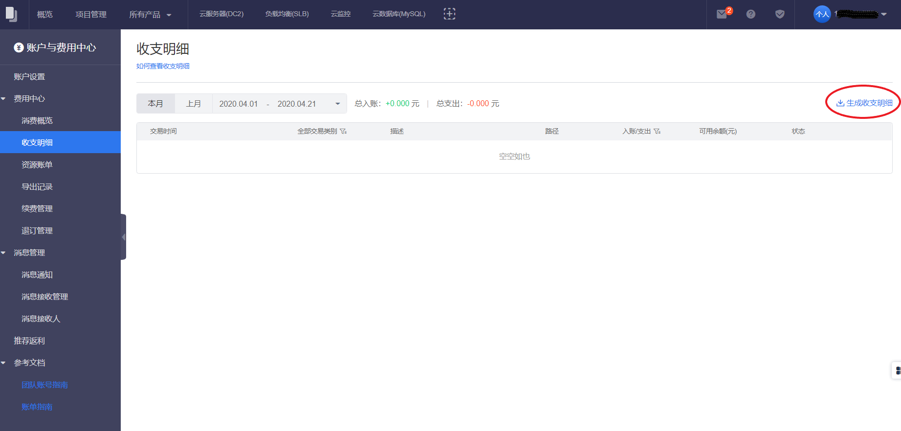
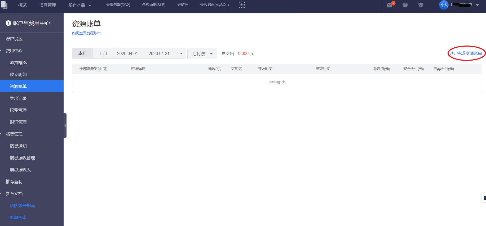
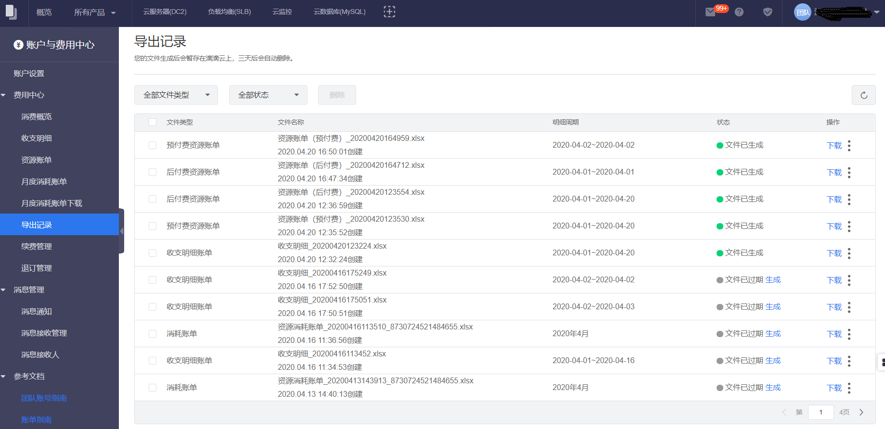

目前滴滴云提供收支明细和资源账单的导出功能，帮助您可以方便及时地对筛选后的收支明细或者资源账单记录进行导出。

目前导出记录文件生成后会暂存在滴滴云上，三天后会自动变为“文件已过期”状态。
##操作步骤
1. 进入费用中心
	- 单击右上角用户名。
	- 在浮动窗口单击 **费用中心**。
2. 单击左侧导航栏的 **收支明细**或者 **资源账单**。
3. 按照您的需求，筛选出想要导出的 **收支明细**或者 **资源账单**记录。
4. 单击右上角的 **生成收支明细** 或者 **生成资源账单** 。
 
 
5. 在弹窗，单击 确认生成，自动跳转到 导出记录 模块。
6. 文件状态为 文件已生成 时，单击操作列的 下载，即可对导出记录进行下载。
 

>说明
>>当导出记录状态为“文件生成中”时，支持对该记录进行删除。

>>当导出记录状态为“文件已生成”时，支持对该记录进行下载和删除。

>>当导出记录状态为“文件生成失败”时，支持对该记录进行重新生成和删除。

>>当导出记录状态为“文件已过期”时，支持对该记录进行重新生成和删除。