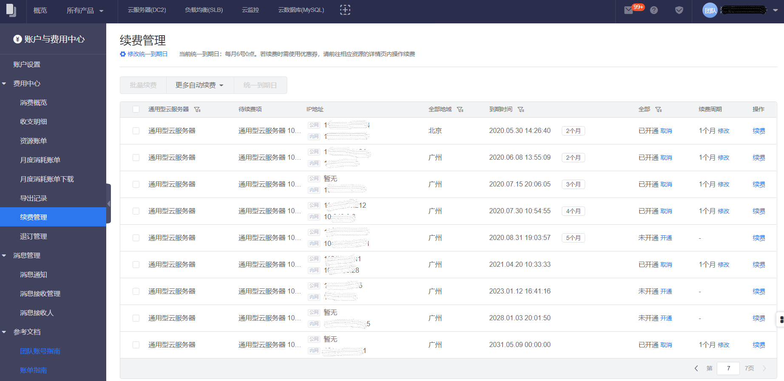

您可以在您购买的滴滴云产品到期前进行续费，或设置自动续费，也可以在到期后规定时间内进行续费（到期后可续费时间规定，请参见相应产品文档）。

为了确保您的业务续费成功，建议您在业务到期前办理续费。业务续费以最终结算成功为准。

##单个资源续费
1. 进入费用中心
	- 单击右上角用户名。
	- 在浮动窗口单击 **费用中心**。
2. 单击左侧导航栏的 **续费管理**。
3. 在续费管理页，找到要续费的资源， 单击 续费 。
4. 选择续费时长，然后单击 确定。
5. 支付完成后，续费成功。

##批量续费
1. 进入费用中心
	- 单击右上角用户名。
	- 在浮动窗口单击 **费用中心**。
2. 单击左侧导航栏的 **续费管理**。
3. 在续费管理页，找到要续费的资源，勾选多个资源， 单击 批量续费 。
4. 选择续费时长，然后单击 确定。
5. 支付完成后，续费成功。

##自助续费
1. 进入费用中心
	- 单击右上角用户名。
	- 在浮动窗口单击 **费用中心**。
2. 单击左侧导航栏的 **续费管理**。
3. 在续费管理页，找到要管理自助续费的资源，勾选该资源， 单击 更多自助续费 。
4. 选择开通、取消或者修改自助续费。当选择开通或者修改时，需要设置新的续费时长，资源到期后将按您选择的时长进行自动续费。

>说明
>>自动续费将于资源到期前7天进行扣费，请保持余额充足。

>>自动续费支持云券及余额支付。

 