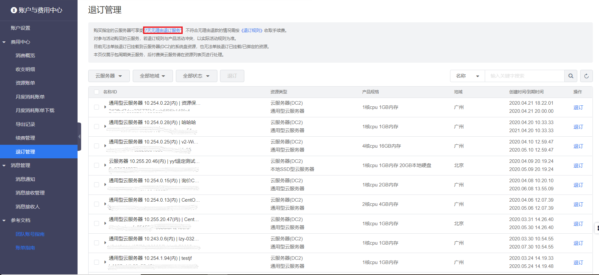
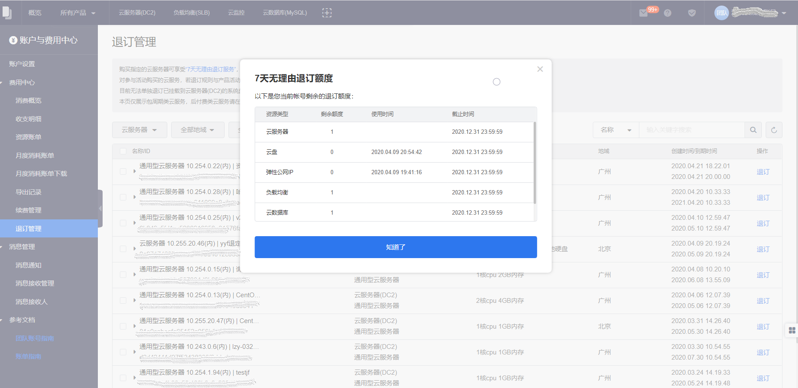

在以包年或包月形式新购如下产品的七天内（包含产品使用时间，七天内时间为从产品购买时间点开始计算7*24小时内），可申请无理由全额退款。支持七天无理由退款的产品包括新购包年包月产品：云服务器DC2、云服务器GPU、云盘EBS、EIP、云数据库Mysql、Redis、负载均衡实例。

目前以下资源不支持七天无理由全额退款：

- 付费方式有变更的资源不支持七天无理由全额退款。
- 有过升降配或续费变更的包月资源不支持七天无理由全额退款。

>说明
>>每个账户下每种云产品每年可享受七天无理由退订1台云产品实例的权利，超过次数或期限的云产品实例的退订将按照《非七天无理由退款规则》执行。

##操作步骤
1. 进入费用中心
	- 单击右上角用户名。
	- 在浮动窗口单击 **费用中心**。
2. 单击左侧导航栏的 **退订管理**。
3. 单击上方提示框里的 **七天无理由退订服务**。
 
4.在七天无理由退订额度弹窗，查看云服务器、云服务器、云盘、弹性公网IP、负载均衡、云数据库和云弹性缓存
的七天无理由退订额度。
 