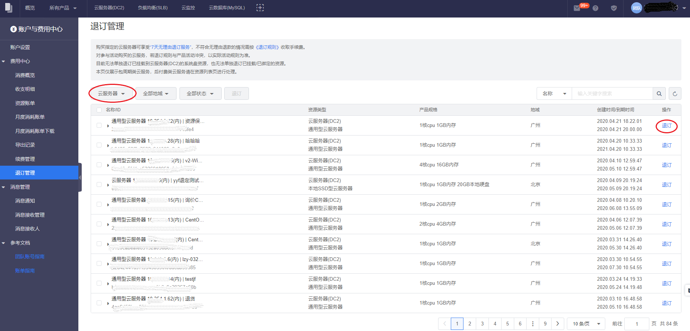
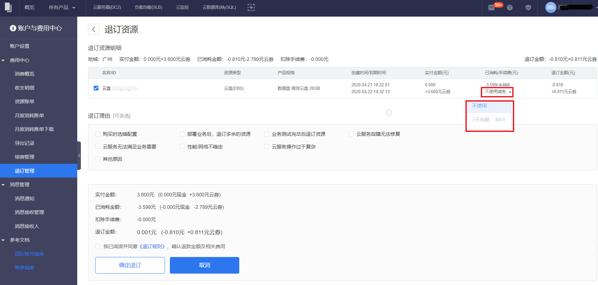
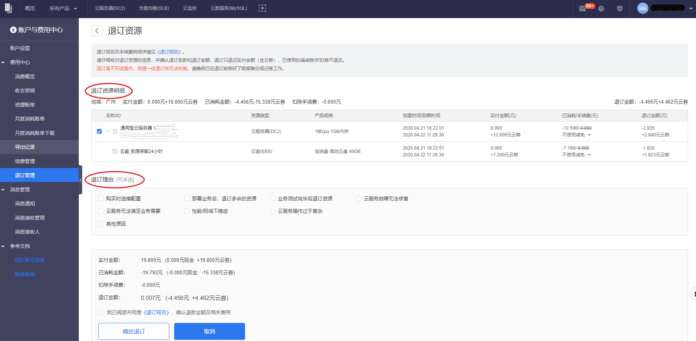

目前滴滴云可退订退款的服务仅限于以包年包月预付费方式购买的特定产品/服务，针对前述服务，滴滴云支持的退订类型为：七天无理由退订、非七天无理由退订。

退订是不可逆操作，资源一经退订将无法恢复。请确保已在退订前做好了数据备份或迁移工作。

退订规则及手续费明细详情见[《退订规则》](/static/费用中心产品文档/07-退订管理/退订规则.md)。
##操作步骤
1. 进入费用中心
	- 单击右上角用户名。
	- 在浮动窗口单击 **费用中心**。
2. 单击左侧导航栏的 **退订管理**。
3. 目前支持以下筛选方式：
	- 按资源类型筛选：目前支持云服务器、云盘、弹性公网IP、负载均衡、云数据库和云弹性缓存。
	- 按地域筛选：单击全部地域，可以选择查看全部地域、北京和广州的记录。
	- 按状态筛选：单击 全部状态 ，可以选择全部状态和可退订的记录。
4. 在退订管理列表，找到想要退订的资源，单击操作列的 退订 。
 
5. 在退订资源弹窗请仔细核对退订资源的信息，并确认退订条款和退订金额，退订只退还实付金额（含云券），已使用的满减券/折扣券不退还：
	- 核实您的退订资源信息。
	- 选择您是否使用七天免赔：单击 不使用减免 下拉框，选择 **不使用** 或者 **七天免赔**。每个账户下每种云产品每年可享受七天无理由退订1台云产品实例的权利，当您已经使用过该云产品的七天免赔额度时，下拉框里显示 余0次 。
	
	- 选择退订原因。
	- 核实您的退订金额。
	- 阅读《退订规则》，并勾选。
6. 单击 确认退订。 如无特殊情形，退订处理周期正常情况下为2-3个工作日，如果产品退订成功，系统自动将余额退回至您的滴滴云账户。

