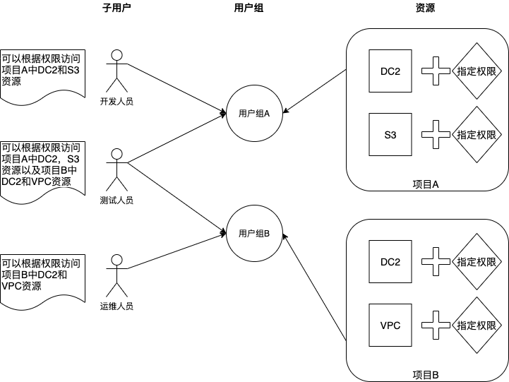

身份与访问控制（Identity and Access Management，简称IAM）是滴滴云为客户提供的用户身份管理与资源访问控制的Web服务，可以帮助您控制对滴滴云资源的访问。该服务免费，不另行收费。

##主要功能
- 对主账号资源的访问共享：可以授权其他用户管理主账号中的资源，而不必共享主账号的身份凭证。
- 精细化的权限管理：可以针对不同资源向不同人员授予不同权限。
- 统一账单：IAM用户所产生的所有费用都由主账号承担支付。
- 最终一致性：IAM 通过数据中心中的多个服务器之间复制数据来实现高可用性，跨地域策略同步会导致策略生效延迟。

##产品优势
通过IAM，您可以创建并管理IAM子用户，并通过策略控制这些子用户对资源的操作权限。当您需要多用户协同管理资源时，可以使用IAM在不共享您的身份凭证的情况下，实现按需分配最小权限，降低信息安全的风险。

##应用场景
当面临下面情况时，企业主账号的拥有者，可以根据人员变动，随时调整变更每个子用户的资源访问权限。

- 某企业在滴滴云拥有多种云资源，包括：DC2、EBS、VPC、S3等。
- 企业中有不同职能的员工，包括开发、测试、运维等。
- 开发人员需要拥有相关开发云资源的读写权限，测试人员需要拥有相关测试云资源的读写权限，运维人员负责所有云资源的日常运营。

 

